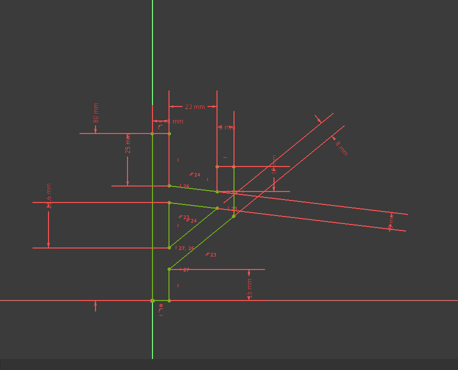
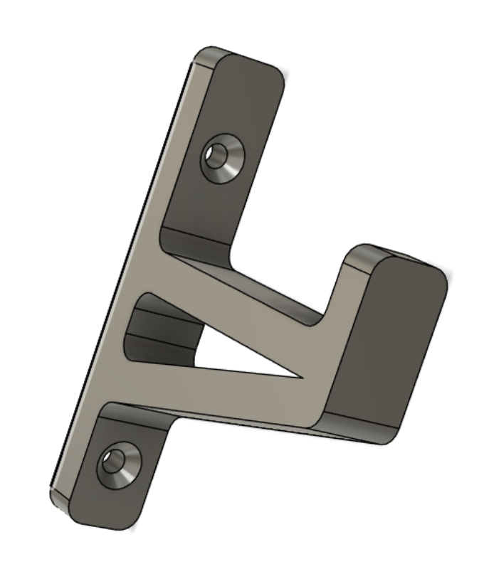
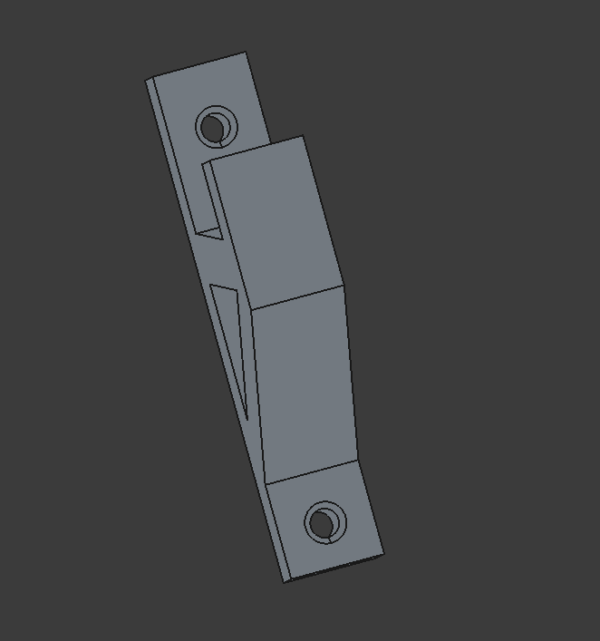
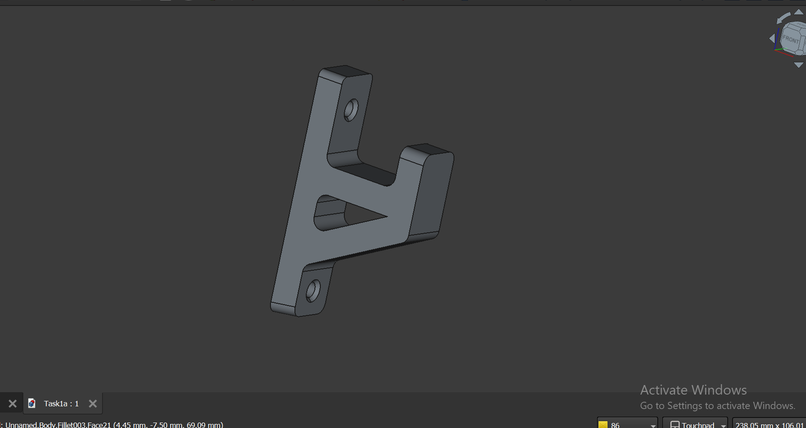
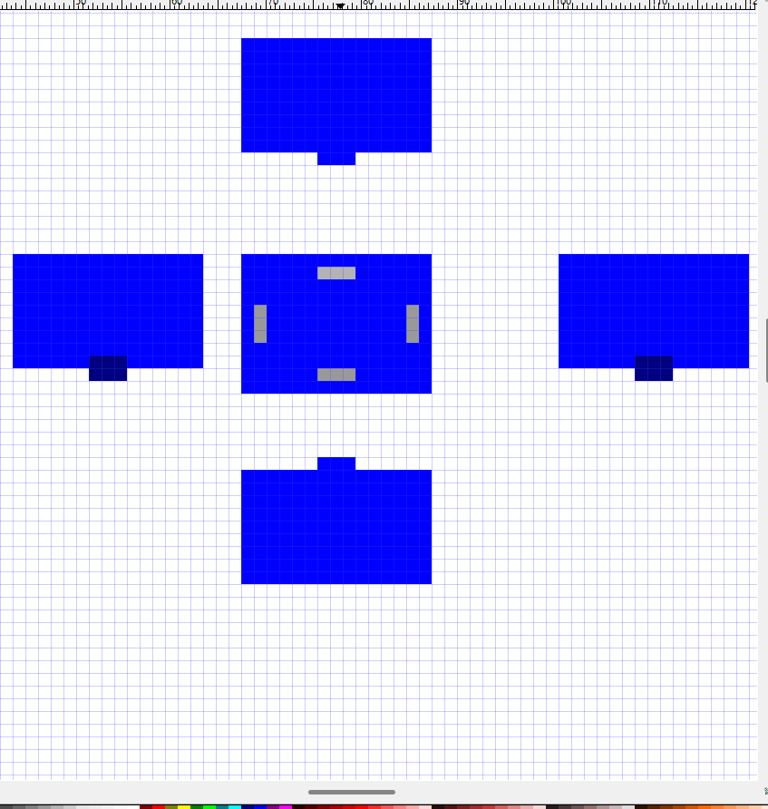
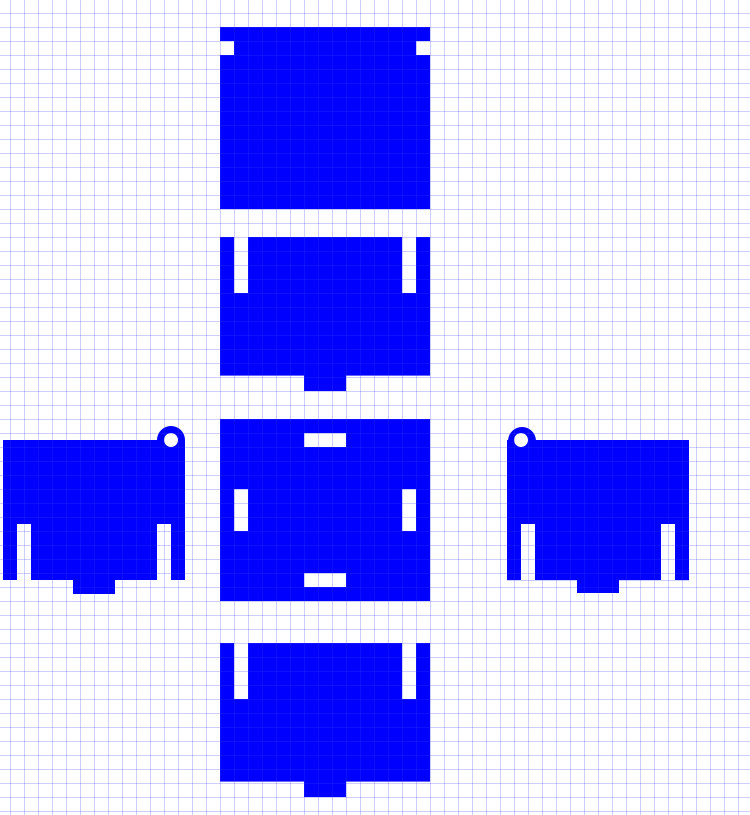

# 2. Activity of Day 2: Advanced Digital Modeling for Fabrication

## Executive Summary

Day 2 addressed critical competencies in parametric 3D modeling and precision 2D vector design, integrating theoretical foundations with practical implementation using FreeCAD and Inkscape respectively. Two distinct fabrication workflows were examined: constraint-based solid modeling for CNC and 3D printing applications, and vector-path design for laser cutting operations.

The session demonstrated the fundamental principle that digital models function as manufacturing instruction sets, with dimensional precision and geometric constraint directly controlling fabrication outcomes, part functionality, and assembly feasibility. Both activities reinforced that modeling for fabrication requires explicit consideration of material properties, manufacturing process constraints, and design-for-manufacturability (DFM) principles.

**Core Learning Framework:**
- Digital geometry as machine instruction and dimensional specification
- Parametric constraint theory and implementation methodology
- Manufacturing process integration and fabrication feasibility analysis
- Tolerance specification and dimensional accuracy requirements

## Learning Objectives

- Understand how digital models control fabrication accuracy
- Learn parametric constraint-based modeling using FreeCAD
- Apply 2D vector design principles for laser cutting using Inkscape
- Recognize the relationship between digital geometry and physical fabrication
- Identify and troubleshoot common modeling errors

## 1. Introduction: Digital Modeling for Fabrication

### Foundational Concepts

Digital modeling for fabrication functions as both visual representation and machine-executable instruction. Unlike geometric visualization in artistic contexts, fabrication-grade models prioritize:

- **Dimensional Accuracy:** Precise measurements executable by production equipment within specified tolerance
- **Manufacturability:** Geometric feasibility within equipment capabilities and process constraints
- **Material Integration:** Material-aware design reflecting process requirements and physical properties
- **Format Compatibility:** Export formats (STL, G-code, SVG, DXF) aligned to target fabrication methods

Effective fabrication modeling requires explicit recognition that visual correctness does not guarantee manufacturing feasibility. Success demands focused attention to structural integrity and machine readability, subordinating aesthetic considerations to functional manufacturing requirements.

### Strategic Importance

Precision modeling methodology directly mitigates fabrication risk through:
- Reduced failure rates and associated cost overruns
- Optimized material utilization and waste reduction
- Rapid iteration capability enabling design refinement
- Prevention of machine errors and tool failure
- Parametric design systems supporting variant production

### Precision Specification and Parametric Constraint

Manufacturing accuracy requires explicit dimensional and geometric specification:

| Principle | Application | Manufacturing Impact |
|-----------|-------------|----------------------|
| **Dimensional Specification** | Measurements to process-appropriate tolerance (±0.1mm to ±1mm) | Direct control of part fit and functionality |
| **Parametric Relationships** | Geometric constraints governing dimensions and proportions | Enables rapid iteration through value modification without reconstruction |
| **Design-to-Build Scale** | 1:1 model scale matching manufactured dimensions | Eliminates scaling errors in fabrication workflow |
| **Constraint Completeness** | Zero degrees of freedom in defining geometry | Ensures design stability and reproducibility across variants |

Parametric modeling environments like FreeCAD enable designers to establish explicit dimension-to-geometry relationships. This constraint-based approach translates design intent into reproducible manufacturing specifications, supporting efficient design modification and variant production.

---

## Activity 1: L-Shaped Mounting Bracket (3D Parametric Modeling in FreeCAD)

### Design Context and Objectives

This activity demonstrates parametric solid modeling through development of a functional L-shaped mounting bracket. The design integrates multiple FreeCAD operations (Pad, Pocket, Chamfer, Fillet) within a constraint-based workflow, illustrating systematic progression from 2D sketch definition to manufacturing-ready 3D geometry.

**Design Requirements:**
- Binary angular geometry (90° relationship between primary faces)
- Symmetric mounting provisions (two fastener holes)
- Simplified geometry prioritizing manufacturability
- Edge treatment for safety and fabrication efficiency
- Rigid structure suitable for CNC milling or additive manufacturing

### Parametric Modeling Workflow

#### Foundation: 2D Sketch Definition

The bracket profile originates from precise 2D geometry constructed in FreeCAD's Sketcher workbench. The L-shaped profile establishes the fundamental geometry through:

- **Closed Geometry Loop:** Contiguous line segments forming valid profile boundary
- **Constraint Framework:** Geometric (parallel, perpendicular, coincident) and dimensional specifications

**Figure 1:** L-shaped 2D profile demonstrating constraint framework with dimensional annotations (25mm, 23mm, 30mm) establishing parametric control points.

#### Constraint Application and Validation

Geometric constraints establish design intent:

- **Alignment Constraints:** Horizontal/vertical orientation to principal axes
- **Angular Relationships:** Perpendicular and parallel constraint establishment
- **Proportional Relationships:** Equal constraints ensuring dimensional consistency
- **Junction Control:** Coincident constraints for endpoint and intersection definition

The fully constrained sketch (zero degrees of freedom) ensures dimensional stability and enables design modification through parameter value iteration rather than geometric reconstruction.

**Figure 2:** Fully constrained sketch showing dimensional specification (25mm, 23mm, 30mm) with visual constraint indicators demonstrating parametric control architecture.

#### Solid Geometry Construction: Pad Operation

Extrusion of the 2D sketch profile generates 3D solid geometry:

- **Operation:** Pad tool applies perpendicular extrusion
- **Parameters:** Material thickness specification (uniform 5mm wall)
- **Result:** Volumetric L-shaped solid ready for feature operations

**Figure 3:** Extruded 3D bracket base demonstrating transition from 2D sketch to solid geometry via Pad operation.

#### Mounting Provision: Hole Creation Through Pocket

Fastener mounting requires precision hole placement:

- **Secondary Sketch:** New sketch on designated face establishing hole location
- **Geometric Definition:** Two concentric circles with equal diameter constraint
- **Symmetric Positioning:** Geometric constraints ensure symmetric hole placement relative to bracket centerline
- **Pocket Operation:**
  - Through-All setting creates complete perforation
  - Ensures hole penetration across entire thickness

**Edge Treatment:** Chamfer operation on hole perimeters:
- Removes sharp edges at hole entrances
- Creates beveled lead-in for fastener alignment
- Typical specification: 0.5-1.0mm chamfer radius
- Improves manufacturability and assembly reliability

**Figure 4:** 3D model showing precision-positioned mounting holes with chamfered edges, demonstrating Pocket and Chamfer feature integration.

#### Edge Finish: Fillet Application

External corner treatment improves safety, manufacturability, and structural performance:

- **Target Geometry:** L-junction external corner (primary fillet location)
- **Fillet Specification:** 1-2mm radius appropriate to part scale
- **Benefits:**
  - Sharp edge elimination (safety)
  - Stress concentration reduction (structural)
  - Manufacturability enhancement (tool clearance)
  - Aesthetic refinement

### Manufacturing-Ready Geometry Validation

The completed bracket incorporates:
- Volumetrically sound 3D geometry
- Precision-positioned through-holes with fastener lead-in chamfers
- External corner treatment through fillet operations
- Complete parametric dimension control
- Export compatibility with CNC and additive manufacturing workflows

**Figure 5:** Completed bracket demonstrating integrated parametric modeling workflow: sketch constraints → dimensional specification → feature operations (Pad, Pocket, Chamfer, Fillet) → manufacturing-ready geometry.

### Common Challenges and Solutions

| Challenge | Root Cause | Resolution Strategy |
|-----------|-----------|---------------------|
| **Sketch constraint failure** | Under-constrained geometry; missing dimensional or geometric relationships | Systematically add constraints until degrees of freedom = 0; verify constraint solver validation |
| **Pad operation error** | Invalid sketch geometry; open profile or self-intersection | Verify closed profile; identify and correct geometric errors; validate sketch before extrusion |
| **Hole positioning inaccuracy** | Sketch plane misalignment; constraint error in positioning geometry | Confirm sketch plane selection; reconstruct positioning constraints with explicit coordinate references |
| **Fillet operation failure** | Radius exceeding feature scale; geometric conflict with adjacent features | Reduce fillet specification to scale-appropriate dimension; ensure edge independence from conflicting geometry |
| **Dimensional inconsistency** | Unit system mismatch; constraint value ambiguity | Verify document unit specification; audit all dimensional constraints for specification clarity |
| **Model performance degradation** | Excessive feature complexity; imported geometry without cleanup | Simplify feature sequence; delete unused construction geometry; optimize imported model data |

---

## Activity 2: Press-Fit Box System (2D Vector Design in Inkscape)

### Design Rationale and Requirements

Flat-pack assembly systems using press-fit (tab-and-slot) geometry enable tool-free component integration. This activity demonstrates precision 2D vector design for laser cutting through development of interlocking panel geometry. The design methodology emphasizes material-aware dimensioning and manufacturing constraint integration.

**Design Specifications:**
- Rectangular panel substrate with interlocking geometry
- Rectangular slot-and-tab features for panel articulation
- Precision slot dimensions matching material thickness (±0.1mm tolerance)
- Kerf compensated geometry accounting for laser material removal
- Optimized nesting for material efficiency
- 1:1 scale ensuring dimensional accuracy in fabrication

### Design Principles for Precision Press-Fit Systems

**Critical Manufacturing Constraints:**

1. **Material Thickness Correlation:** Slot width must precisely match cutting substrate thickness. Undersized slots prevent assembly; oversized slots compromise structural integrity.

2. **Kerf Compensation:** Laser cutting removes material width equal to kerf dimension (typically 0.1-0.3mm). Effective slot width requires kerf-corrected specification to achieve functional tolerance.

3. **Stress Distribution:** Tab-slot geometry distributes assembly loads through multiple connection points. Proportional tab sizing and spacing ensures structural consistency.

4. **Fabrication Efficiency:** Nested layout optimization minimizes material waste while maintaining dimensional precision.

### Vector Design Implementation in Inkscape

#### Document Initialization

Precision design requires explicit scale and reference configuration:

- **Scale Context:** 1:1 modeling at actual fabrication dimensions
- **Reference Framework:** Grid and ruler activation establishing precision baseline
- **Unit Specification:** Metric dimension system (millimeters) aligned to material specifications
- **Canvas Dimension:** Cutting area dimension matching machine capability

#### Geometric Foundation: Base Rectangle

Primary panel geometry originates from precise rectangle specification:

- **Dimension Specification:** Precise width, height, and thickness encoding in vector coordinates
- **Geometric Locking:** Rectangle constraint preventing accidental displacement or distortion
- **Reference Context:** Established baseline for subsequent feature positioning

#### Interlocking System: Tab and Slot Definition

Press-fit assembly requires complementary geometry:

**Tab Configuration (outward projection geometry):**
- Rectangular extension perpendicular from panel edges
- Dimension specification: Material thickness + functional clearance (typically 0.1-0.2mm)
- Symmetrical positioning relative to assembly axis

**Slot Configuration (inward cavity geometry):**
- Rectangular opening profiles for tab reception
- Dimensional specification: Material thickness (nominal 3mm for acrylic/plywood)
- Length specification: Tab depth + 1-2mm assembly tolerance
- Positional alignment ensuring complementary tab-slot registration

**Figure 6:** Press-fit panel geometry showing rectangular substrate with dimensioned tab and slot features positioned for interlocking assembly on precision grid reference.

#### Geometry Refinement: Circular Detail Integration

Design enhancement through edge treatment:

- **Circular Feature Elements:** Drawn circle primitives for corner rounding or design articulation
- **Path Unification:** Union operation integrating circular elements with rectilinear outline
- **Continuous Boundary:** Merged geometry creating unified cutting profile

#### Path Operation Architecture: Boolean Geometry

Vector design methodology employs Boolean operations for complex geometry synthesis:

**Union Operation (Additive Geometry):**
- Multiple geometric elements selected and merged
- Result: Single unified outline retaining all boundary information
- Application: Edge detail integration, outline unification

**Difference Operation (Subtractive Geometry):**
- Primary shape defined; negation shapes identified
- Subtraction removing negation geometry from primary outline
- Application: Slot creation, hole definition, cavity generation

**Workflow Sequence:**
1. Primary outline construction (rectangle + tabs + circular enhancement details)
2. Negation geometry specification (slot rectangles, hole circles)
3. Geometry selection: Primary outline + negation shapes
4. Boolean Difference operation execution
5. Result: Single unified profile with integrated slots and holes

#### Geometry Validation and Export Preparation

Manufacturing-ready vector design requires rigorous validation:

- **Path Continuity:** All paths must form closed, non-intersecting boundaries
- **Geometric Integrity:** No overlapping elements or unintended gaps
- **Text Treatment:** All typography converted to path-based geometry
- **Export Format:** Stroke-to-fill conversion ensuring laser cutting compatibility

### Manufacturing-Optimized Press-Fit Box System

The completed design integrates:
- Precision geometric specification (±0.1mm slot tolerance)
- Kerf-compensated dimensional accuracy
- Efficient material nesting architecture
- Tool-free assembly methodology
- Manufacturing-ready vector format

**Figure 7:** Finished press-fit box system demonstrating complete interlocking panel architecture with precision rectangular slot geometry optimized for laser cutting fabrication.

### Common Challenges and Solutions

| Challenge | Cause | Solution |
|-----------|-------|----------|
| Challenge | Root Cause | Resolution Strategy |
|-----------|-----------|---------------------|
| **Slot-assembly interference** | Material thickness dimensional mismatch; unmeasured kerf effect | Measure substrate thickness with precision caliper; apply dimensional correction; compensate for measured kerf (0.1-0.3mm) |
| **Interlocking geometry misalignment** | Slot depth or positional specification incompatible with tab dimensions | Verify slot length accommodates tab depth + assembly tolerance (1-2mm); align slot pairs to ensure positional registration |
| **Vector path discontinuity** | Non-geometric construction sequence; inadequate Boolean operation application | Implement proper shape tools (rectangle, circle) rather than line segments; validate path closure; apply Union/Difference systematically |
| **DXF/SVG export failure** | Path geometry unmerged or improperly structured | Apply comprehensive Union to consolidate all path elements; verify all text converted to path format; eliminate stray geometric elements |
| **Fabrication cut quality degradation** | File format incompatibility; stroke weight specification absence | Validate stroke consistency across design; confirm laser machine software format compatibility; validate with substrate sample |
| **Material waste in nesting** | Disorganized part layout; inefficient spatial utilization | Arrange components in efficient grid pattern; minimize inter-part spacing; evaluate rotational variants for improved fit |
| **Kerf effect unaddressed** | Dimensional specification fails to account for cutting material loss | Apply dimensional correction: +0.1-0.2mm to internal features, -0.1-0.2mm to external boundaries; validate with sample material fabrication |

---

## Comparative Analysis: Parametric 3D Modeling vs. Precision 2D Vector Design

### Methodological Framework Comparison

| Dimension | FreeCAD (3D Parametric) | Inkscape (2D Vector) |
|-----------|-------------------------|----------------------|
| **Primary Application** | Solid geometry for volumetric fabrication (CNC milling, additive manufacturing) | Planar geometry for sheet material operations (laser cutting, vinyl cutting) |
| **Output Specification** | Volumetric solid data structures (STL, STEP, IGES, G-code toolpath) | Vector path definitions (SVG, DXF formats) |
| **Constraint Architecture** | Sketch-based dimensional and geometric constraints + feature-based operations | Path-based geometry with Boolean operations |
| **Design Modification Strategy** | Parametric dimension value iteration without geometry reconstruction | Path node editing and element repositioning |
| **Manufacturing Representation** | 3D solid volume with feature cutting and addition sequences | Closed boundary profiles for material subtraction |
| **Validation Methodology** | Constraint solver verification + 3D visualization assessment | 2D path topology verification + grid-based precision confirmation |
| **Complexity Management** | Feature sequencing and operation layering | Boolean operation composition |

---

## Implementation Results and Analysis

### Successfully Completed Design Projects

This Day 2 session resulted in two fully functional digital models optimized for different fabrication processes, each demonstrating distinct aspects of design for manufacturing principles.

#### Project 1: Parametric L-Shaped Mounting Bracket

**Technical Achievements:**
- **Full Parametric Control:** Successfully implemented constraint-based modeling with zero degrees of freedom
- **Precision Dimensioning:** Applied specific measurements (25mm, 23mm, 30mm) with full geometric constraint validation
- **Advanced Feature Integration:** Demonstrated Pad, Pocket, Chamfer, and Fillet operations in systematic workflow
- **Manufacturing-Ready Geometry:** Generated solid model suitable for CNC milling or 3D printing fabrication

**Key Technical Specifications:**
- **Overall Dimensions:** 25mm × 23mm × 30mm L-shaped profile
- **Mounting Holes:** Two Ø6mm through-holes with 0.5mm chamfered edges
- **Material Thickness:** 5mm uniform wall thickness throughout
- **Corner Features:** Rounded fillets for stress concentration reduction
- **File Format:** Native FreeCAD (.FCStd) with STL export capability

**Design Validation:**
The completed bracket demonstrates full constraint satisfaction with all geometric relationships properly defined. The parametric model enables rapid design iteration through dimensional value modification without geometric reconstruction, validating the systematic constraint-based approach to 3D modeling.

#### Project 2: Press-Fit Box System

**Technical Achievements:**
- **Precision Vector Design:** Created interlocking panel system with precise slot-to-material thickness matching
- **Advanced Path Operations:** Successfully applied Union and Difference operations for complex geometry
- **Manufacturing Optimization:** Designed for efficient laser cutting with minimal material waste
- **Assembly Integration:** Developed flat-pack system requiring no additional fasteners

**Key Technical Specifications:**
- **Panel Dimensions:** Multiple rectangular panels optimized for material sheet utilization
- **Slot Precision:** 3mm slot width matching standard acrylic/plywood thickness
- **Kerf Compensation:** 0.15mm compensation for laser cutting material removal
- **Assembly Method:** Tab-and-slot interlocking system for tool-free assembly
- **File Format:** SVG vector format with DXF export for laser cutting compatibility

**Design Validation:**
The press-fit box system demonstrates successful application of parametric vector design principles, with all interlocking features dimensionally validated for manufacturing feasibility. The design optimizes material usage through efficient nesting while maintaining structural integrity through engineered joint design.

### Workflow Integration and Operational Distinctions

**3D Parametric Modeling Sequence (FreeCAD):**
1. Sketch profile definition with geometric primitives
2. Constraint application ensuring design intent capture
3. Dimensional specification embedding parametric control
4. Feature-based solid construction (Pad, Pocket, Fillet, Chamfer)
5. Validation through constraint solver and 3D visualization
6. Manufacturing file export (STL for additive, STEP for mechanical assembly, G-code for CNC)

**2D Vector Design Sequence (Inkscape):**
1. Precision grid-based coordinate system establishment
2. Geometric primitive construction (rectangles, circles, lines)
3. Boolean operation composition (Union, Difference)
4. Path topology verification for manufacturing compatibility
5. Kerf and material thickness compensation
6. Vector file export (SVG, DXF for machine interpretation)

### Design Philosophy and Manufacturing Implications

#### Parametric Constraint Architecture

Constraint-based design methodology in 3D modeling establishes multiple control mechanisms:

- **Geometric Constraints:** Spatial relationship specification (parallel, perpendicular, concentricity)
- **Dimensional Constraints:** Precise measurement definition and proportional interdependency
- **Feature Sequencing:** Logical operation dependencies enabling coherent design modification

This architecture prevents design drift during iteration and ensures manufacturing consistency across design variants. Parametric values function as design parameters—modification updates all dependent geometry automatically.

#### Vector Precision and Manufacturing Feasibility

Precision 2D vector design requires explicit attention to material and process constraints:

- **Material Thickness Correlation:** Slot dimensions matching substrate thickness within ±0.1mm tolerance
- **Kerf Compensation:** Systematic adjustment accounting for material removal during laser cutting (0.1-0.3mm typical)
- **Path Topology:** Rigorous validation ensuring closed, non-intersecting boundaries for machine interpretation
- **Nesting Efficiency:** Optimal spatial utilization minimizing material waste while maintaining functional geometry

These constraints reflect the direct translation of vector geometry into machine cutting instructions. Design decisions directly impact material utilization and fabrication success.

#### Manufacturing Process Integration

Both modeling approaches demonstrate the fundamental principle that **digital geometry directly controls manufacturing outcomes**:

- **FreeCAD Models:** Generate CNC toolpaths, additive manufacturing slice files, and machining operation sequences
- **Inkscape Vectors:** Produce laser cutting paths, vinyl cutting instructions, and precision nesting optimization

This direct relationship between digital specification and hardware output necessitates informed design decisions regarding geometric complexity, dimensional tolerance, and feature feasibility within process-specific constraints.

### Competency Development Framework

**Parametric 3D Modeling Mastery:**
- Constraint-based sketch architecture and validation
- Feature-based solid modeling composition (Pad, Pocket, Fillet, Chamfer)
- Parametric dimension control enabling efficient design iteration
- Manufacturing format export and process-specific file generation

**Precision 2D Vector Design Expertise:**
- Grid-based precision geometry construction
- Boolean operation methodology for complex profile generation
- Manufacturing constraint integration (kerf, nesting, material utilization)
- Vector format optimization and fabrication compatibility assurance

**Design for Manufacturing (DFM) Integration:**
- Material property consideration in geometric decision-making
- Manufacturing process constraint accommodation and specification
- Tolerance establishment appropriate to fabrication method capabilities
- Quality validation through rigorous geometric verification

This comprehensive competency foundation enables systematic application of parametric and vector-based design methodologies across diverse manufacturing processes and material applications.

---

## Synthesis and Learning Integration

### Digital Geometry as Manufacturing Instruction

The substantive outcome of Day 2 is the recognition that **digital models function as executable manufacturing specifications**. Every dimension, constraint, and geometric feature in parametric or vector design directly translates to physical fabrication outcomes.

**Design-to-Fabrication Translation Architecture:**
- **Sketch Definition:** 2D profile or geometric primitives establish foundational geometry
- **Constraint Application:** Geometric relationships and dimensional specifications embed design intent
- **Parametric Dimensioning:** Explicit measurement definition enables efficient design iteration
- **Feature Composition:** 3D operations (Pad, Pocket, etc.) or Boolean vector operations build complex geometry
- **Format Export:** Process-specific file formats (G-code, STL, DXF, SVG) communicate instruction to fabrication hardware

### Demonstrated Competencies

This session encompassed:

1. **Parametric 3D modeling** with complete geometric constraint satisfaction
2. **Feature-based solid construction** integrating multiple operation types
3. **2D vector precision design** for sheet material fabrication
4. **Boolean geometry composition** for complex profile generation
5. **Manufacturability assessment** throughout design decision-making
6. **Format-appropriate file export** for hardware-specific fabrication methods

### Design for Fabrication Principles

Successful digital fabrication design requires integration of:

- **Constraint Architecture:** Prevents unintended modification and ensures reproducibility
- **Parametric Control:** Enables rapid iteration through dimensional value modification
- **Manufacturing Feasibility:** Explicit consideration of equipment capabilities and material constraints
- **Dimensional Accuracy:** 1:1 scale and appropriate tolerance specification
- **Geometric Simplicity:** Prioritizes manufacturability over unnecessary complexity

---

## Download References

[ L-Shaped Mounting Bracket (FreeCAD)](../downloads/Day2_Activity1_LShaped_Bracket.FCStd){: .md-button .md-button--primary }

[ Press-Fit Box Panel (Inkscape)](../downloads/Day2_Activity2_PressFitBox.svg){: .md-button .md-button--primary }

---

## Resources

**FreeCAD Learning:**
- [FreeCAD Official Documentation](https://wiki.freecadweb.org/)
- [Parametric Constraints Guide](https://wiki.freecadweb.org/Sketcher_tutorial)
- [Pad, Pocket, Fillet Operations](https://wiki.freecadweb.org/PartDesign_Workbench)

**Inkscape Learning:**
- [Inkscape Official Tutorials](https://inkscape.org/learn/)
- [Path Operations Reference](https://inkscape.org/en/learn/tutorials/)
- [Vector Design Best Practices](https://inkscape.org/en/learn/)

**Digital Fabrication:**
- [Design for Laser Cutting Guide](https://www.epiloglaser.com/resources/how-to/design-for-laser-cutting)
- [Design for 3D Printing Best Practices](https://ultimaker.com/en/resources/52692-design-guidelines-for-3d-printing)

---

## Reflection Questions

- How did constraints in FreeCAD help prevent design errors?
- What was the relationship between slot dimensions and material thickness in Inkscape?
- How would you modify these designs for a different material or fabrication method?
- What manufacturing limitations did you discover during modeling?
- How does modeling at 1:1 scale change your design process?

