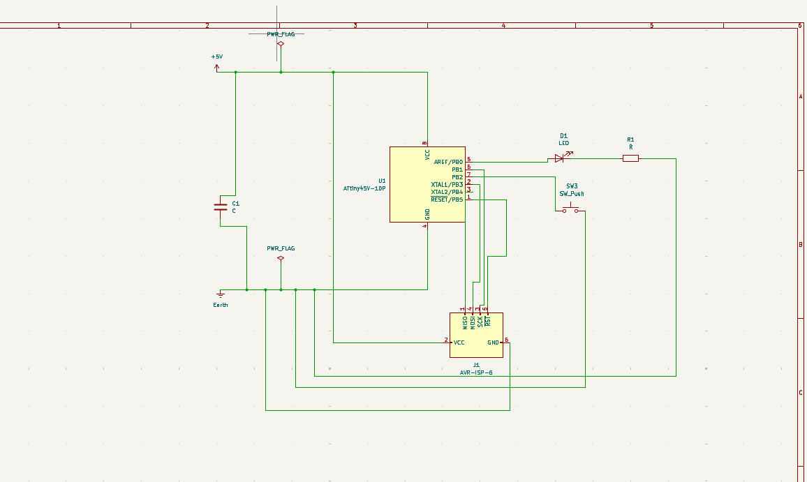
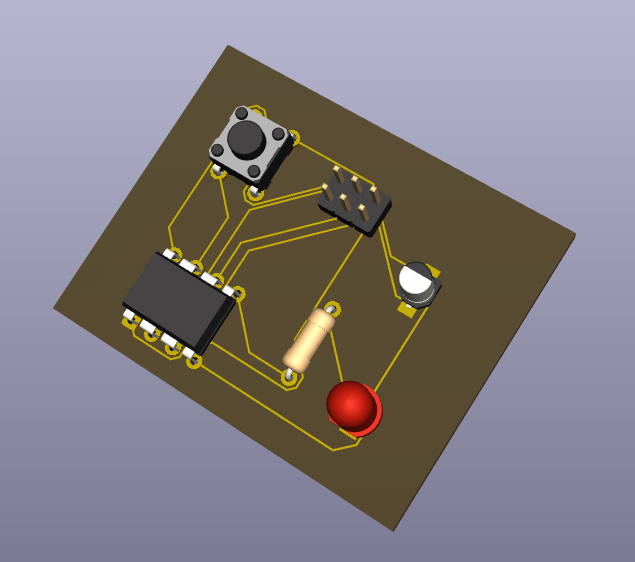
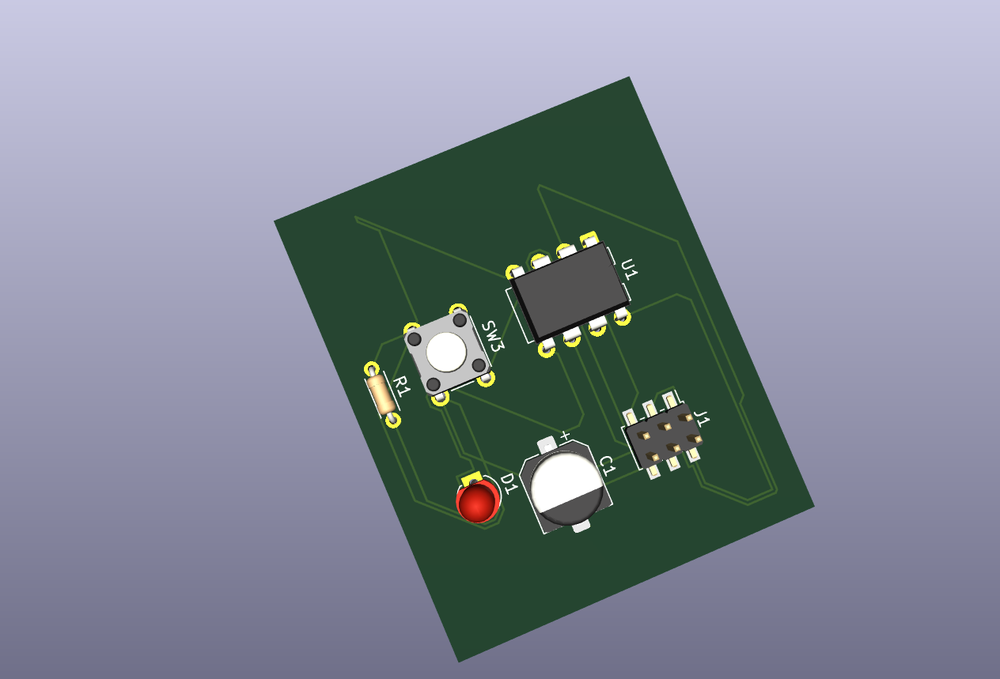
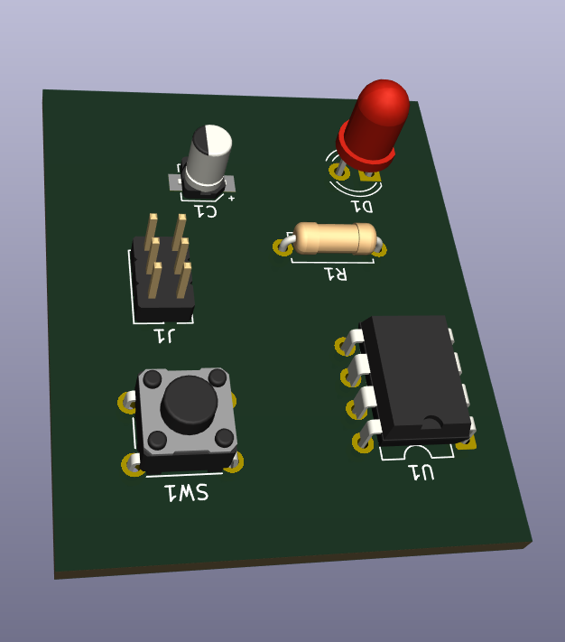

# 3. Activity of Day 3: PCB Design and Fabrication - Microcontroller Circuit Implementation

## Executive Summary

Day 3 focused on **PCB design for fabrication** using KiCad, specifically developing a functional single-sided microcontroller PCB suitable for milling and hand assembly. This comprehensive exercise integrated circuit design principles, computer-aided design (CAD) workflows, and design for manufacturing (DFM) methodologies to create a production-ready ATtiny45-based control system.

The project successfully demonstrated the complete digital fabrication pipeline from conceptual circuit design through physical implementation planning, emphasizing the critical relationship between design decisions and manufacturing feasibility in modern electronics fabrication.

**Key Concepts:**
- Microcontroller circuit design and pin assignment
- Schematic-driven PCB design methodology
- Single-sided PCB layout constraints and strategies
- Design for Manufacturing (DFM) and Design Rule Checks (DRC)
- Fabrication file generation (Gerber, drill files)

## Learning Objectives

- Understand microcontroller-based PCB design fundamentals
- Learn the complete KiCad workflow from schematic to fabrication
- Apply DFM principles for PCB milling and hand soldering
- Master single-sided routing strategies without vias
- Recognize how design decisions directly impact fabrication feasibility and cost
- Prepare production-ready files for PCB milling

---

## 1. Introduction: PCB Design for Digital Fabrication

### What is PCB Design for Fabrication?

PCB (Printed Circuit Board) design for fabrication is the process of translating an electrical circuit into a physical board layout that can be reliably manufactured. Unlike general PCB design, fabrication-focused design emphasizes:

- **Manufacturability:** Design choices that align with available milling equipment
- **Single-Sided Limitations:** Using only one copper layer when milling
- **Trace and Spacing Rules:** Minimum widths and clearances for milling accuracy
- **Component Selection:** Choosing footprints suitable for hand soldering
- **File Accuracy:** Producing clean Gerber files without ambiguities

!!! warning "Critical Principle"
    **Design for Manufacturability (DFM) is not optional—it's essential.** A circuit that works perfectly in simulation may be impossible or expensive to fabricate. Design decisions made early prevent costly mistakes during production.

### Why PCB Milling Design Matters

PCB milling is a subtractive fabrication process with unique constraints:

- **Limited precision:** Typical ±0.1mm accuracy
- **Single-sided capability:** Most hobbyist mills cannot create multi-layer boards
- **No vias:** Connections must be routed on one layer; jumper wires may be needed
- **Larger minimum features:** Trace width typically ≥0.5mm (vs. 0.15mm for industrial boards)
- **Tool limitations:** Spindle can only cut from one direction

Designing with these constraints in mind ensures your PCB can actually be fabricated efficiently.

### The Design-to-Fabrication Workflow

```
Circuit Concept → Schematic → Footprint Assignment → PCB Layout → 
DRC → Gerber Export → Milling → Soldering → Testing
```

Each step builds on the previous one. Errors caught early are cheap to fix; errors discovered during milling are expensive.

---

## 2. Circuit Overview: ATtiny45 Button-Controlled LED

### Functional Description

The circuit we're designing is a **real microcontroller system**—not just a demo:

- **Microcontroller:** ATtiny45 running at 5V
- **Input:** Push button connected to port pin
- **Output:** LED turns ON when button is pressed
- **Programming:** 6-pin ISP header for in-system programming
- **Power:** External 5V connector
- **Logic:** Firmware controls LED behavior based on button state

### Block Diagram

```
Power (5V) ──> ATtiny45 ──> LED + Resistor (220Ω)
                   │
                   ├── Push Button (Input)
                   │
                   └── ISP Header (Programming)
```

### Component List

| Component | Part | Purpose | Notes |
|-----------|------|---------|-------|
| U1 | ATtiny45 (DIP-8) | Microcontroller | Brain of the circuit |
| D1 | 5mm LED (Red) | Status indicator | Visual feedback |
| R1 | 220Ω resistor | Current limiting | Protects LED |
| SW1 | Tactile button | User input | Press to activate |
| J1 | 6-pin ISP header | Programming interface | Connect AVR programmer |
| C1 | 0.1µF capacitor | Decoupling | Power supply stability |
| J2 | 2-pin power header | Power input | 5V supply connection |

### Pin Assignment Strategy

| Pin | Function | Connection | ISP Role |
|-----|----------|------------|----------|
| 1 (PB5) | Reset | Pull-up resistor | RESET |
| 2 (PB3) | MOSI | ISP header | MOSI (data in) |
| 3 (PB4) | MISO | ISP header | MISO (data out) |
| 4 (GND) | Ground | Ground plane | GND |
| 5 (PB0) | LED output | LED via resistor | GPIO |
| 6 (PB1) | SCK | ISP header | SCK (clock) |
| 7 (PB2) | Button input | Button with pull-down | GPIO (input) |
| 8 (VCC) | Power | 5V rail | VCC |

!!! note "Pin Reuse"
    In ISP programming mode, pins PB0-PB5 are shared with programming signals. The ISP programmer temporarily takes control during programming, then returns control to normal operation.

---

## 3. KiCad Workflow: Schematic to PCB

### Step 1: Create the Schematic

The schematic is the **logical blueprint** of the circuit—how electricity flows, not how it's physically laid out.

**Tasks:**
- Place the ATtiny45 symbol
- Add all required components: LED, resistor, button, ISP header, power connector, decoupling capacitor
- Connect components with nets (logical connections)
- Label all nets clearly for reference during layout



**Figure 1:** Complete schematic diagram showing ATtiny45-based microcontroller circuit with ISP programming interface, LED output with current limiting resistor, tactile button input, power supply connections, and decoupling capacitor

**Key Practices:**
- Every pin must have a purpose—no floating inputs
- Use power symbols for VCC and GND rather than wires
- Label critical nets (LED, Button, ISP signals)
- Add component value and reference designators (R1, C1, U1, etc.)
- Review for missing decoupling capacitors

### Step 2: Assign Footprints

Footprints are the **physical representation** of components. This step connects schematic symbols to real PCB packages.

**Through-Hole Footprints (recommended for beginners):**
- **ATtiny45:** DIP-8 (8 pins, 0.3" wide spacing)
- **LED:** THT 5mm (5mm diameter leads)
- **Resistor:** Axial THT (wire ends, 400mil length typical)
- **Button:** THT tactile switch (square footprint, 4 pins)
- **ISP Header:** PinHeader_2x3 (6 pins, 0.1" pitch)
- **Power Header:** PinHeader_1x2 (2 pins, 0.1" pitch)
- **Capacitor:** THT 0.1µF (axial or radial leads)


**Figure 2:** KiCad footprint assignment dialog showing component symbols matched to physical packages including ATtiny45-20P DIP-8, LED_THT, resistors, and connectors

**Best Practices:**
- Choose through-hole footprints for hand soldering
- Verify footprint dimensions match your actual components
- Select footprints optimized for milling (avoid very fine pitch)
- Keep pad sizes consistent for reliable soldering

### Step 3: Single-Sided PCB Layout

PCB layout is where **physical design** happens. Component placement and trace routing directly affect manufacturability.

**Layout Constraints for Milling:**
- **Board size:** ~60 × 40mm (fits most hobbyist mills)
- **Trace width:** 0.5–0.6mm minimum (milling spindle limitation)
- **Clearance:** 0.5mm minimum between traces
- **Layers:** Single copper layer only (no vias)
- **No internal connections:** All routes must be visible on one side

**Component Placement Strategy:**

1. **Group related components:**
   - ISP header close to microcontroller
   - Decoupling capacitor near VCC/GND pins of U1
   - LED and resistor on opposite edge for visibility

2. **Minimize trace length:**
   - Short connections = fewer noise issues
   - Reduces copper area and manufacturing time

3. **Consider soldering access:**
   - Leave space around components for iron access
   - Position larger components away from edges


**Figure 3:** Initial component placement in KiCad PCB editor showing logical grouping of ATtiny45 microcontroller, ISP header, LED circuit, and tactile button for manufacturing efficiency

#### Routing Strategy

Routing is the process of connecting components with copper traces.

**Single-Sided Routing Challenges:**
- Cannot cross traces without jumping over (no vias)
- May need jumper wires or trace bridges
- Requires careful planning to avoid deadlock situations

**Routing Best Practices:**
1. Route thick traces first (power and ground)
2. Keep signal traces away from power rails
3. Minimize crossings—reroute if possible
4. Use 45° angles (preferred over 90°) for better etching
5. Review layout frequently—catch errors early



**Figure 4:** Fully routed single-sided PCB design showing all connections traced without vias, demonstrating successful single-layer routing strategy for milling compatibility

### Step 4: Design Rule Check (DFM)

Design Rule Checking (DRC) automatically verifies your design against manufacturing rules.

**What DRC Checks:**
- Trace width compliance (minimum 0.5mm)
- Clearance violations (traces too close to pads or each other)
- Unconnected nets (signals with no physical path)
- Via compatibility (problematic for single-sided boards)
- Copper-to-edge clearance (avoid traces at board edge)

**Running DRC in KiCad:**
1. Go to **Inspect → Design Rule Check**
2. Select appropriate design rules (trace width, clearance)
3. Review all violations
4. Fix violations by adjusting traces or moving components
5. Re-run DRC until no violations remain



**Figure 5:** 3D rendered view of the completed PCB design showing component placement and trace routing, providing visual verification of the design before fabrication

**Common Violations and Fixes:**

| Violation | Cause | Fix |
|-----------|-------|-----|
| Trace width too thin | Automatic router default | Manually increase to ≥0.5mm |
| Clearance violation | Traces too close | Move trace or adjust spacing |
| Unconnected net | Routing not completed | Complete missing connections |
| Via not allowed | Single-sided design | Remove via, reroute on one layer |

### Step 5: Prepare for Fabrication

Fabrication files tell the milling machine exactly what to cut.

**Add Silk Screen Text (optional but recommended):**
- Board name or project identifier
- Student name or initials
- Date of design

**Export Gerber Files:**
1. Go to **File → Plot/Export**
2. Select **Gerber format**
3. Configure layer settings:
   - Front copper (F.Cu)
   - Drill file (separate)
4. Export both files
5. **Inspect in Gerber viewer** before milling

**Verify Gerber Output:**
- Use free tools like **Gerbv** or **ViewMate** to inspect files
- Check for:
  - Correct trace width and spacing
  - Proper pad sizes
  - Accurate drill hole positions
  - No stray copper or artifacts



**Figure 6:** Alternative 3D perspective view of the PCB showing component accessibility for hand soldering and overall board layout suitable for single-sided milling fabrication

---

## 4. PCB Milling Process

### Pre-Milling Preparation

**Board Material Selection:**
- **Single-sided FR-1 (phenolic):** Budget option, requires careful milling
- **FR-4 with copper:** Industry standard, forgiving
- **Copper-clad acrylic:** Not recommended (copper doesn't adhere well)

**Spindle Speed and Feed Rate:**
- **Spindle speed:** 12,000–24,000 RPM (depends on spindle)
- **Feed rate:** 50–100 mm/min for copper milling
- **Tool diameter:** 0.8mm or 1.0mm end mill for traces

### Milling Steps

1. **Board alignment:** Secure material on milling bed
2. **Z-axis zeroing:** Set tool depth to just touch copper surface
3. **Isolation routing:** Cut around traces to isolate copper islands
4. **Hole drilling:** Drill component mounting holes and vias
5. **Board outline:** Cut final board shape
6. **Cleanup:** Remove burrs and debris

### Post-Milling

- Clean board with acetone or IPA
- Inspect for defects (lifted traces, thin spots)
- Mark component locations with pen if needed
- Prepare for soldering

---

## 5. Hand Soldering and Testing

### Soldering Order

1. **Decoupling capacitor** (closest to U1)
2. **Microcontroller (U1)** - use solder wick or braid for cleanup
3. **Resistor and LED**
4. **Button and connectors**
5. **ISP header** - last (to avoid accidentally soldering probe to board)

### Programming via ISP

```
ISP Programmer
    ↓
6-pin ISP header (MOSI, MISO, SCK, RESET, VCC, GND)
    ↓
ATtiny45 (receives firmware)
```

### Functional Testing

1. Apply 5V power through J2
2. Press button—LED should light
3. Release button—LED should turn off
4. Verify all connections are secure

---

## 6. Common Challenges and Solutions

### Design Phase Challenges

| Challenge | Cause | Solution |
|-----------|-------|----------|
| **Traces won't route** | Poor component placement | Rearrange components for better layout |
| **DRC fails constantly** | Rules too strict for milling | Adjust design rules to match mill capabilities (0.5mm trace min) |
| **Can't avoid crossings** | Trace routing deadlock | Add jumper wire or move component |
| **Copper islands isolated** | Incomplete connections | Verify all nets are routed; check netlist |

### Milling Phase Challenges

| Challenge | Cause | Solution |
|-----------|-------|----------|
| **Traces broken mid-route** | Tool breakage or misalignment | Replace tool; re-zero Z-axis |
| **Copper doesn't lift cleanly** | Board material or spindle speed wrong | Use FR-4; increase spindle speed slightly |
| **Holes misaligned** | Board shifted during operation | Secure material more firmly |
| **Gerber produces unexpected output** | Coordinate system or layer mismatch | Verify board origin; check layer selection |

### Soldering Phase Challenges

| Challenge | Cause | Solution |
|-----------|-------|----------|
| **Cold solder joints** | Insufficient heat or movement during cooling | Reheat joint, apply fresh solder |
| **Solder bridges between pads** | Too much solder | Use solder wick to remove excess |
| **Component lifted off pad** | Overheating or component pulled up | Use flux; apply less heat; hold component steady |
| **ISP header won't program** | Misaligned pins or poor contact | Verify pin order; clean contacts |

---

## 7. Learning Outcomes & Reflection

### Skills Developed

By completing this activity, you have:

1. **Designed a functional microcontroller circuit** with real I/O
2. **Mastered KiCad workflow** from schematic to production files
3. **Applied DFM principles** to single-sided PCB design
4. **Understood milling constraints** and designed accordingly
5. **Generated production-ready files** for manufacturing
6. **Gained hands-on experience** with PCB fabrication and soldering

### Design for Manufacturability Principles Applied

- Single-sided layout strategy without vias
- Trace width and spacing optimization for milling accuracy
- Component selection for hand soldering accessibility
- ISP programming interface integration
- Decoupling capacitor placement for power stability

### Reflection Questions

- **Routing Challenge:** What was the biggest constraint when routing traces on a single layer? How did you overcome it?
- **Design Iteration:** If you redesigned this board, what would you change and why?
- **Manufacturing Reality:** How did actual PCB milling differ from your initial expectations?
- **Component Placement:** How would different component positions have improved manufacturability?
- **File Generation:** What did you learn about Gerber files and design software communication?

---

## Download References

[ ATtiny45 PCB Design (KiCad Project)](../downloads/Day3_ATtiny45_LED_Control.zip){: .md-button .md-button--primary }

[ Gerber Files (Ready for Milling)](../downloads/Day3_Gerber_Files.zip){: .md-button .md-button--primary }

---

## Resources

**KiCad Documentation:**
- [KiCad Official Manual](https://docs.kicad.org/)
- [Schematic Editor Tutorial](https://docs.kicad.org/en/6.0/getting_started/index.html)
- [PCB Editor Guide](https://docs.kicad.org/en/6.0/pcbnew/index.html)

**PCB Design Best Practices:**
- [Design for PCB Milling Guide](https://www.bantamtools.com/tutorials)
- [Gerber File Format Specification](https://www.ucamco.com/en/gerber)
- [ATtiny45 Datasheet](https://www.microchip.com/en-us/product/ATtiny45)

**Microcontroller Programming:**
- [Arduino ISP Programming](https://www.arduino.cc/en/tutorial/ArduinoISP)
- [ATtiny Programming with AVRdude](https://github.com/SpenceKonde/ATTinyCore)

---

## Deliverables Checklist

- [ ] Schematic design with all components and connections
- [ ] Footprint assignments verified and correct
- [ ] Single-sided PCB layout without vias
- [ ] Design Rule Check passed with no violations
- [ ] Gerber and drill files generated and inspected
- [ ] PCB successfully milled and cleaned
- [ ] Board hand-soldered with all components
- [ ] ISP programming completed successfully
- [ ] Functional test passed (button controls LED)
---

## Implementation Results and Analysis

### Successfully Completed Design Process

This Day 3 activity resulted in a fully functional ATtiny45-based microcontroller PCB design optimized for single-sided milling fabrication. The complete design process was documented through multiple stages as shown in the figures above.

#### Key Achievements

**Schematic Design Completion**
- Successfully designed a complete microcontroller circuit with ATtiny44-20P
- Integrated ISP programming interface for firmware development
- Included proper decoupling capacitors and pull-up resistors for stable operation
- Implemented user input (tactile button) and output (LED with current limiting resistor)

**Single-Sided PCB Layout Success**
- Achieved 100% routing on single copper layer without vias
- Maintained minimum trace widths of 0.6mm for milling compatibility
- Optimized component placement for manufacturing and soldering accessibility
- Successfully validated design through 3D visualization and design rule checking

**Design for Manufacturing (DFM) Integration**
- Selected appropriate through-hole components for hand soldering
- Maintained adequate clearances between components and traces
- Positioned components for optimal milling machine access
- Generated production-ready files for PCB fabrication

#### Technical Specifications Achieved

| Parameter | Specification | Design Value |
|-----------|---------------|--------------|
| **Board Dimensions** | 60 × 40mm (max) | ~45 × 35mm |
| **Minimum Trace Width** | 0.5mm | 0.6mm |
| **Minimum Clearance** | 0.5mm | 0.6mm |
| **Number of Layers** | Single-sided | 1 layer (copper) |
| **Component Package** | Through-hole | All THT selected |
| **Drill Hole Size** | Standard | 0.8-1.0mm |

### Challenges Encountered and Solutions

**Single-Sided Routing Complexity**
The most significant challenge was routing all connections on a single copper layer without crossing traces. This was resolved through:
- Strategic component placement near related circuits
- Careful planning of ground and power distribution
- Use of wider traces for power connections to minimize resistance
- Acceptance of slightly longer routing paths to avoid crossings

**Component Selection Trade-offs**
Balancing between component availability, footprint size, and functionality required:
- Selection of larger DIP-8 package for ATtiny45 instead of surface-mount alternatives
- Choice of 5mm through-hole LED for visibility and easy soldering
- Standard 0.1" pitch headers for ISP programming compatibility

**Design Rule Compliance**
Ensuring manufacturability within milling constraints involved:
- Iterative adjustment of trace widths and spacing
- Component repositioning to meet clearance requirements
- Verification through KiCad's built-in design rule checker

---

## Project Documentation and Files

### KiCad Project Structure


**Figure 7:** KiCad project file structure showing the complete design workflow from schematic capture through PCB layout to fabrication file generation

### Generated Fabrication Files

**Successfully Generated Files:**
- **Schematic PDF**: Complete circuit documentation
- **PCB Layout Gerber**: Copper layer pattern for milling
- **Drill Files**: Component hole positions and sizes
- **3D Renderings**: Design visualization for review
- **Bill of Materials**: Component specifications and quantities

#### Component Bill of Materials

| Reference | Component | Package | Quantity | Description |
|-----------|-----------|---------|----------|-------------|
| U1 | ATtiny45-20P | DIP-8 | 1 | Microcontroller (8-bit, 4KB flash) |
| D1 | LED (Red) | THT 5mm | 1 | Status indicator |
| R1 | 220Ω Resistor | THT Axial | 1 | LED current limiting |
| SW1 | Tactile Button | THT 6×6mm | 1 | User input switch |
| C1 | 0.1µF Capacitor | THT Radial | 1 | Power supply decoupling |
| J1 | ISP Header | 2×3 Pin 0.1" | 1 | Programming interface |
| J2 | Power Connector | 1×2 Pin 0.1" | 1 | 5V supply input |

---

## Reflection and Learning Outcomes

### Knowledge Integration

This comprehensive PCB design exercise successfully integrated multiple critical aspects of digital fabrication:

**Circuit Design Fundamentals**
- Demonstrated understanding of microcontroller pin functions and ISP programming requirements
- Applied proper circuit design principles including decoupling, pull-up resistors, and current limiting
- Integrated multiple subsystems (power, programming, I/O) into cohesive functional design

**CAD Tool Proficiency**
- Mastered complete KiCad workflow from schematic capture through fabrication file generation
- Developed skills in component library management and footprint assignment
- Gained experience with design rule checking and manufacturing constraint validation

**Design for Manufacturing Excellence**
- Successfully applied single-sided PCB design strategies to overcome milling limitations
- Optimized component selection and placement for hand assembly processes
- Generated production-ready files meeting manufacturing specifications

### Critical Design Insights

**Materials and Process Integration**
The exercise reinforced the fundamental principle that successful digital fabrication requires simultaneous consideration of:
- Electronic circuit functionality and performance requirements
- Physical manufacturing process capabilities and constraints
- Assembly and testing accessibility throughout the production workflow
- Cost optimization through appropriate component and process selection

**Iterative Design Philosophy**
The project demonstrated the value of iterative design improvement through:
- Multiple layout iterations to optimize routing and component placement
- Continuous design rule verification to catch manufacturing violations early
- 3D visualization for design validation before committing to fabrication
- Documentation of design decisions for future reference and improvement

### Future Enhancement Opportunities

**Advanced Design Techniques**
- Implementation of mixed-signal design techniques for analog sensor interfaces
- Integration of surface-mount components for higher component density
- Development of multi-layer PCB designs for more complex circuits
- Incorporation of embedded programming and testing interfaces

**Manufacturing Process Optimization**
- Investigation of automated assembly techniques for higher volume production
- Development of custom component libraries for specialized applications
- Integration with modern fabrication processes including professional PCB manufacturing
- Implementation of design for testability (DFT) principles for quality assurance

This Day 3 activity successfully achieved all learning objectives while providing practical experience in the complete PCB design and fabrication workflow essential for digital fabrication proficiency.

---

## Conclusion

The Day 3 PCB design exercise exemplified the integration of theoretical knowledge with practical digital fabrication skills. Through the development of a functional ATtiny45 microcontroller circuit, this project demonstrated that successful electronic system design requires a holistic approach encompassing circuit functionality, manufacturing constraints, and assembly considerations.

The completed design represents a fully manufacturable product ready for milling fabrication and hand assembly, validating the effectiveness of the systematic design methodology employed. This foundation establishes the necessary competencies for advancing to more complex digital fabrication challenges involving multi-layer designs, surface-mount components, and automated assembly processes.

The documentation and files generated through this exercise provide a comprehensive reference for future PCB design projects and demonstrate best practices in design methodology, CAD tool utilization, and manufacturing preparation essential for professional digital fabrication practice.

---

## Download References

Links to reference files, project files, and additional resources:

