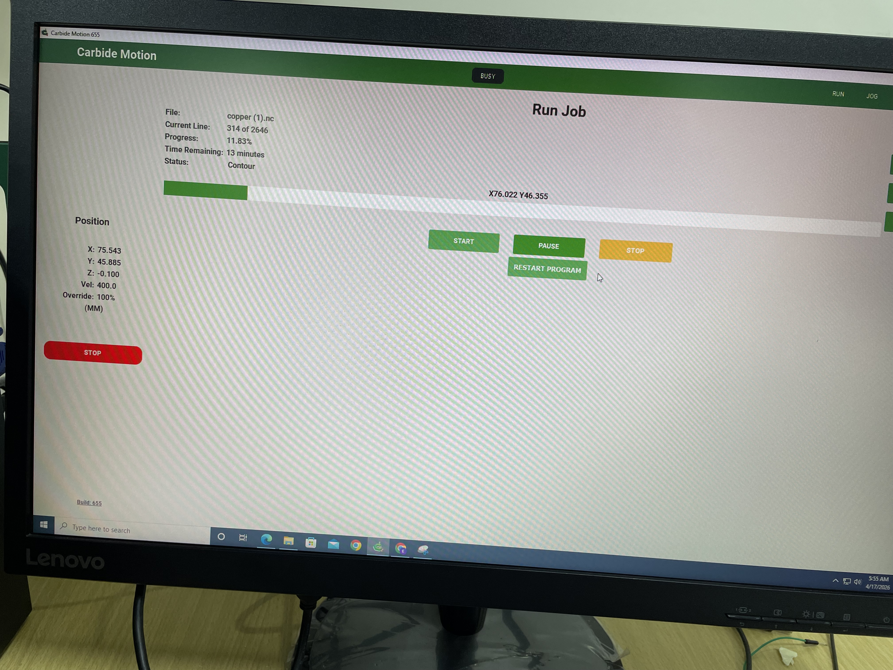
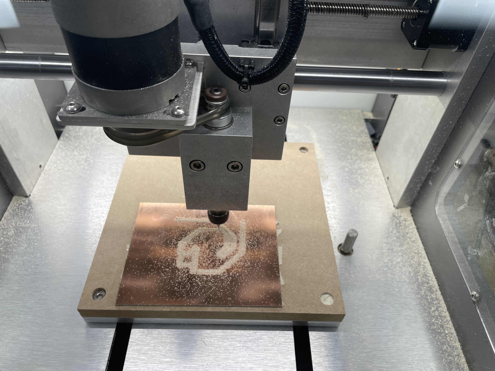
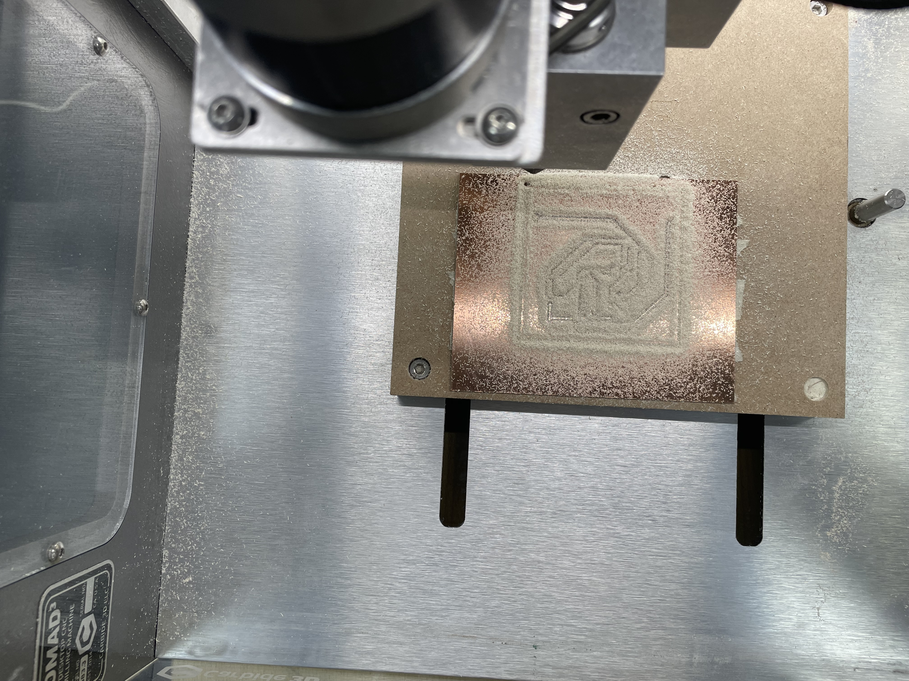
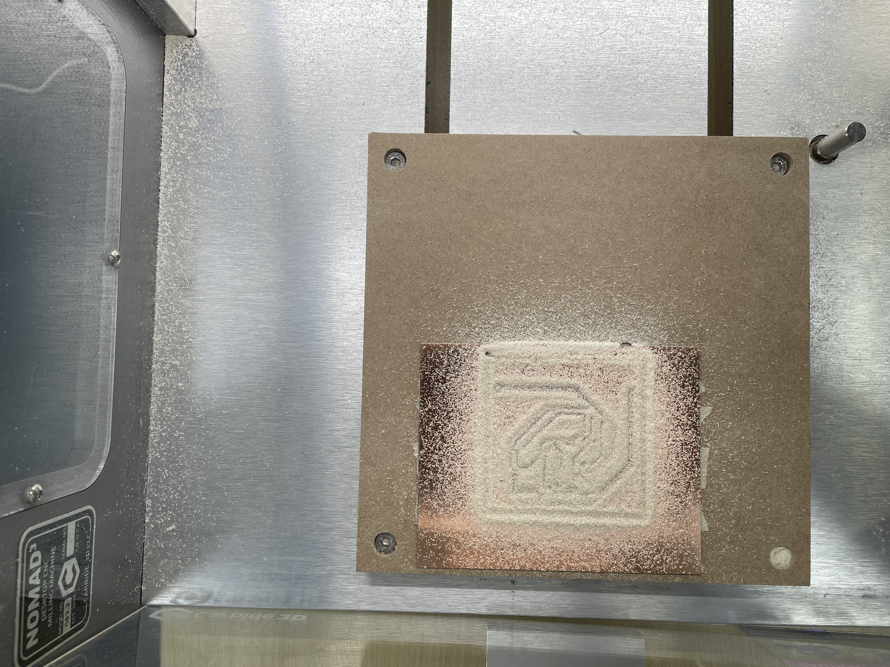
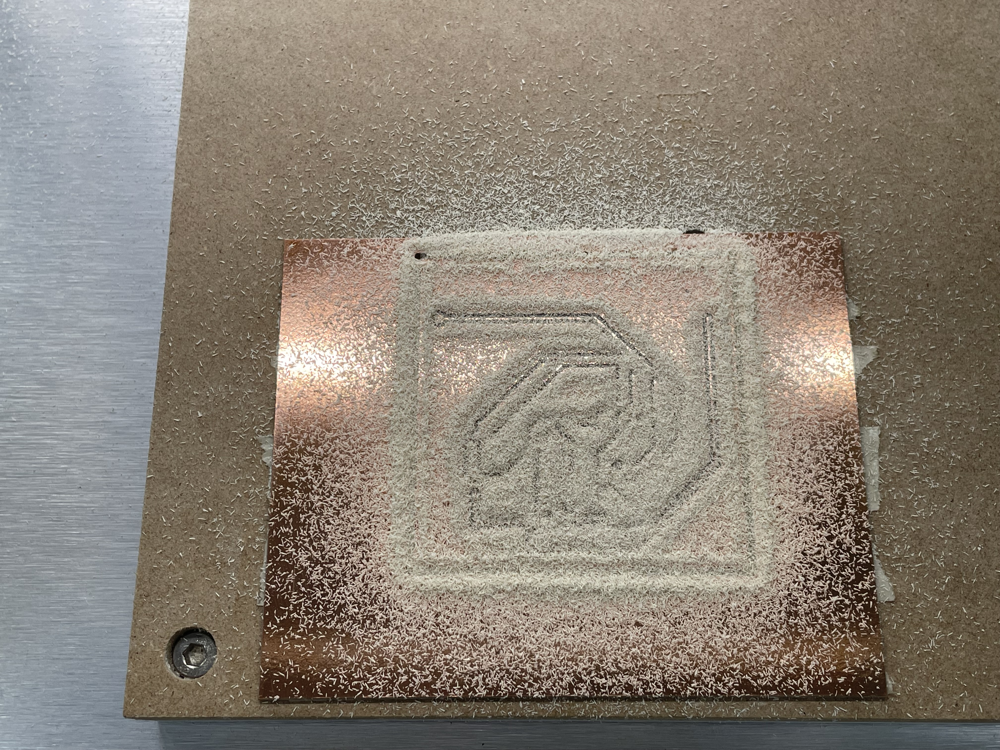
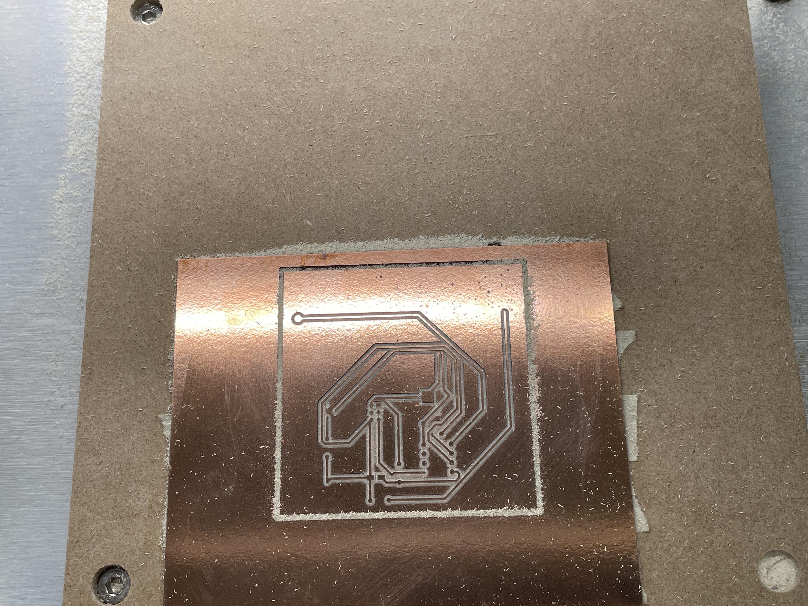

# Day 3: ATtiny45 Microcontroller PCB Design and Fabrication

## Executive Summary

Day 3 focused on the complete design and fabrication workflow for a single-sided printed circuit board featuring the ATtiny45 microcontroller. This embedded system integrates core input/output capabilities including LED control, push-button user interaction, and ISP (In-System Programming) functionality. The project emphasized practical constraints of single-layer PCB design, component footprint selection, and design-for-manufacturability (DFM) principles specific to hobbyist PCB milling fabrication.

The development process integrated schematic capture in KiCad, footprint assignment for through-hole components, manual trace routing optimization for single-sided constraints, design rule checking, and generation of machine-executable fabrication files. The resulting prototype validates the effectiveness of methodical circuit design and demonstrates successful translation of digital specification into functional fabricated hardware.

## Learning Objectives

- Design functional embedded circuits using microcontroller integration
- Apply KiCad workflow from schematic to PCB layout
- Understand single-sided PCB design constraints and routing optimization
- Implement ISP programming interface for in-circuit development
- Perform design rule checking and DFM analysis
- Generate and interpret fabrication file formats (Gerber, drill files)
- Validate design through prototype fabrication and testing

## 1. Objective and System Context

This project involved designing a minimalist ATtiny45-based control system capable of LED illumination control via push-button input with in-circuit programmability. The design integrates a microcontroller, discrete logic elements (resistor, capacitor), user interface components (LED, push button), and programming interface (ISP header) onto a single-sided PCB substrate.

**Core System Functions:**
- **Microcontroller Processing:** ATtiny45 executes firmware logic managing LED state transitions
- **User Input:** Push button provides digital input to microcontroller on GPIO pin
- **Visual Feedback:** LED outputs controlled logic state for user observation
- **In-Circuit Programming:** ISP interface enables firmware development and deployment without board removal

## 2. System Overview and Circuit Architecture

The ATtiny45 microcontroller forms the computational core, operating from regulated 5V DC power supply. The microcontroller GPIO pins interface directly to user-facing components and programming headers without intermediate isolation circuitry, reflecting design simplicity appropriate to hobbyist prototyping.

**Circuit Signal Flow:**

1. **Power Distribution:** 5V supply provides regulated voltage to microcontroller VCC pin with local filtering capacitor
2. **LED Output Path:** GPIO pin PB0 drives 220Ω current-limiting resistor connected to LED anode; LED cathode returns to ground
3. **Button Input Path:** Momentary push button connects GPIO pin PB2 to ground; internal pull-up resistor provides high state
4. **ISP Programming Interface:** Six-pin connector provides MISO, MOSI, SCK, RESET, VCC, GND signals for programmer access

**Design Operating Principle:**

The ATtiny45 firmware monitors button input on PB2 for state transitions. Upon button press detection, firmware toggles PB0 output state, controlling LED illumination. The microcontroller executes polling loop or interrupt-driven input handling depending on power consumption requirements and application timing constraints.

## 3. Components Used

| Component | Value | Package | Quantity | Function |
|-----------|-------|---------|----------|----------|
| **Microcontroller** | ATtiny45 | DIP-8 | 1 | Main processing unit |
| **LED** | 5mm Red | THT | 1 | Visual output indicator |
| **Current Limiting Resistor** | 220Ω | 0.25W THT | 1 | LED protection and brightness control |
| **Push Button** | Momentary | THT | 1 | User input device |
| **Decoupling Capacitor** | 0.1 µF | Ceramic THT | 1 | Power supply filtering |
| **Power Header** | 2-pin | THT | 1 | External 5V supply connection |
| **ISP Programming Header** | 2×3 | THT | 1 | ICSP connector for firmware programming |

**Component Selection Rationale:**

All components employ through-hole (THT) technology to align with hobbyist PCB milling capabilities. DIP-8 packaging for the ATtiny45 provides simplified hand-soldering and breadboarding compatibility. Standard 0.1" pin spacing throughout maintains consistency with breadboard and prototyping infrastructure. The 220Ω resistor provides appropriate current limitation for standard 5mm LED under 5V supply (approximately 15mA LED current).

## 4. Schematic Design

The circuit schematic captures the electrical topology defining component interconnections and signal routing. Design methodology prioritized functional clarity and standard electrical practices.

**Schematic Architecture:**

- **Power Rails:** Dual rails representing +5V supply and ground reference distributed across all components
- **Microcontroller Core:** ATtiny45 DIP-8 device central to circuit topology with all pins explicitly defined
- **Output Stage:** PB0 GPIO output connected through 220Ω resistor to LED anode; LED cathode returned to ground
- **Input Stage:** PB2 GPIO input connected to push button; return path to ground; internal pull-up enabled in firmware
- **Programming Interface:** ISP header connected to RESET, SCK, MOSI, MISO pins with supply and ground references
- **Power Conditioning:** 0.1 µF capacitor connected between VCC and ground at microcontroller location for high-frequency noise filtering

**Design Validation:**

The schematic underwent verification to confirm:
- All GPIO pins routed to functional interface (output, input, programming)
- Power and ground connectivity complete across all devices
- Electrical ratings (voltage, current) within component specifications
- No floating or unconnected signal paths

**Figure 1:** Complete circuit schematic demonstrating ATtiny45 microcontroller integration with LED output stage, push-button input, ISP programming interface, and power conditioning. All signal paths and voltage rails explicitly routed.

## 5. Footprint Assignment and Component Placement Strategy

Footprint assignment represents the translation of schematic symbols to physical PCB geometry and land patterns. This step aligns electrical design with manufacturing constraints and fabrication capabilities.

**Footprint Selection Methodology:**

- **ATtiny45:** DIP-8 (300mil package width) provides standard dual-in-line footprint compatible with breadboard and through-hole soldering
- **Passive Resistor and Capacitor:** Standard 0.1" vertical mounting footprints (TH_1/4W, TH_C025)
- **LED:** Radial through-hole footprint with 2mm lead spacing
- **Push Button:** Standard tactile switch footprint with 2.54mm pin pitch
- **Headers:** Pin header footprints with 2.54mm spacing aligned to standard connector ecosystem

**Component Placement Considerations:**

Through-hole component packages dictate vertical mounting orientation. Component leads pass through board perforations and solder to bottom copper layer. Placement strategy prioritized:
- **Signal Integrity:** Input components (button, ISP header) grouped on board periphery
- **Thermal Path:** Current-consuming element (LED resistor) positioned away from microcontroller thermal zone
- **Fabrication Accessibility:** All components arranged for straightforward soldering without component interference
- **Routing Feasibility:** Component placement optimized for single-layer trace routing without excessive jumpers

## 6. PCB Layout and Single-Sided Design Implementation

PCB layout translates schematic connectivity into physical copper geometry suitable for fabrication. Single-sided design constraint restricts all traces to a single copper layer, necessitating careful routing optimization and potential jumper wire incorporation.

**Board Geometry and Constraints:**

- **Board Dimensions:** Approximately 60mm × 40mm footprint selected to encompass component placement with 5mm margin
- **Layer Configuration:** Single copper layer (F.Cu) contains all signal traces and ground plane
- **Design Grid:** 2.54mm (0.1") grid alignment matched to component pin spacing
- **No Via Usage:** Single-sided design eliminates vias; all interlayer connections employ top-side jumper wires where necessary
- **Copper Clearance:** 0.5mm minimum clearance maintained between traces and board perimeter

**Routing Architecture:**

- **Ground Plane Organization:** Continuous ground copper sheet covering maximum feasible board area, providing both electrical and thermal characteristics
- **Signal Traces:** Individual routed traces connecting functional components (power, output, input, programming paths)
- **Jumpers:** Insulated wire segments bridge traces where single-layer physical routing prevents direct copper connectivity
- **Trace Characterization:** Trace width maintained at 0.6mm providing appropriate current-carrying capacity for low-voltage digital signals across ~15mA LED current

**Single-Layer Challenge Resolution:**

The ATtiny45 microcontroller central location created routing density at package pins. Resolution strategy implemented:
1. Power and ground traces routed to pin locations with maximum available space utilization
2. Output trace (PB0→LED resistor) and input trace (PB2←button) routed via opposing board margins
3. ISP header traces directed via longest-path routing, accepting extended trace lengths in exchange for avoided crossings
4. Critical resistor and capacitor placement adjacent to microcontroller to minimize trace lengths

**Figure 2:** Single-sided PCB layout demonstrating trace routing optimization for ATtiny45 circuit. Ground plane provides electrical reference and reduced return path inductance. Output stage, input stage, and programming interface traces routed to minimize layer transitions.

## 7. 3D Visualization and Assembly Review

Three-dimensional board visualization provides geometric validation confirming component placement feasibility, clearance verification, and soldering accessibility before fabrication.

**3D Model Analysis:**

- **Component Orientation Verification:** All through-hole leads perpendicular to board surface; no component mechanical interference
- **Copper Layer Visualization:** Trace routing paths and ground plane distribution visible in rendered view
- **Clearance Assessment:** Visual confirmation of maintained spacing between components and board edges
- **Assembly Accessibility:** Solder-side surface clear for soldering iron access without obstruction

**Figure 3:** Three-dimensional rendering of ATtiny45 control PCB showing component placement, trace routing distribution, and board profile. Vertical through-hole components and wire jumpers visible in assembly configuration.

## 8. Design Rule Check (DRC) Verification

Design rule checking automated verification processes validate PCB layout compliance with manufacturing specifications and electrical design requirements.

**DRC Criteria Verified:**

- **Electrical Continuity:** All schematic nets mapped to corresponding copper traces; no unconnected signal nodes
- **Trace to Trace Clearance:** Minimum 0.5mm spacing maintained between adjacent copper elements; no bridging or shorts
- **Trace Width Compliance:** All traces maintain minimum 0.6mm width; current-carrying capacity verified for 20mA design headroom
- **Via Placement:** No vias required in single-sided design; all connections formed via through-hole component leads
- **Copper to Edge Clearance:** Minimum 5mm margin maintained between copper elements and board perimeter
- **Creepage and Clearance:** Spacing between 5V and ground paths meets isolation requirements for hobbyist fabrication

**DRC Violation Resolution:**

- **Clearance Violations:** Trace routing adjusted to maintain minimum clearance where conflicts identified
- **Unresolved Nets:** All schematic nodes successfully routed; no floating or unconnected signals
- **Width Violations:** Trace specifications verified adequate for circuit current requirements

**Post-DRC Status:** Design achieved clean DRC clearance; no violations reported.

## 9. Fabrication Preparation and File Generation

Fabrication file generation translates PCB design into machine-executable formats consumed by PCB manufacturing and milling equipment.

**File Generation Process:**

1. **Gerber Export:** Primary PCB geometry exported in RS-274X (Gerber) format defining copper layer topology
   - **F.Cu Layer:** Front copper layer containing all signal traces and ground plane
   - **Edge.Cuts Layer:** Board perimeter profile defining milling boundary

2. **Drill File Generation:** NC (numerical control) drill file generated specifying all through-hole positions and diameters
   - Format: Excellon standard drill file
   - Drill specifications: 0.8mm (31mil) for component leads, 1.5mm for jumper wire holes
   - File coordinates: Material location with origin reference point established

3. **Board Layout Documentation:** Assembly drawing exported showing component reference designators and placement locations for solder-side reference during assembly

**File Format Compatibility Verification:**

- **Gerber Specification:** RS-274X Extended Gerber format ensuring compatibility with modern PCB equipment
- **Drill Format:** Excellon format version 2.4 providing precise coordinate specification
- **Coordinate System:** Absolute positioning mode with 2.54mm grid reference

**Fabrication Readiness Confirmation:**

All files verified for completeness and machine readability. Design ready for PCB milling, photo-lithography, or commercial fabrication submission.

## 10. Fabrication Results and Prototype Assembly

The design successfully translated to fabricated hardware through PCB milling process. Prototype assembly and initial functional testing validated design assumptions and circuit operation.

**Fabrication Process Summary:**

PCB substrate mill-cut from FR4 material following board profile. Copper layer milling created trace paths and component mounting pads. Drill operations established through-holes at specified component locations.

**Assembly Process:**

1. Component lead preparation through cropping to appropriate board-penetration depth
2. Through-hole insertion with microcontroller and passive components oriented to copper side
3. Solder application via conventional wave soldering or hand-soldering with iron tool
4. Jumper wire installation bridging single-layer routing conflicts using insulated hookup wire
5. Cold solder joint inspection and repair as necessary

**Prototype Appearance and Physical Validation:**

Fabricated board demonstrates clean trace execution without copper bridges or missing segments. Component placement aligns with design specification. All through-holes drilled at design locations with appropriate dimensional accuracy.

**Figure 4:** Fabricated PCB top view showing component placement, trace routing structure, and overall board finish quality.

**Figure 5:** Component and trace detail showing solder joint quality, lead preparation, and copper trace execution on fabricated substrate.

**Figure 6:** Assembled microcontroller board showing integrated component positioning, power connectivity, and user interface elements.

**Figure 7:** Prototype under operating conditions demonstrating LED illumination in response to programmed microcontroller output.

**Figure 8:** ISP programming header connected to development programmer, enabling firmware development and deployment.

**Figure 9:** Complete assembled ATtiny45 control system ready for firmware programming and functional testing.

## 11. Challenges Encountered and Solutions Implemented

**Challenge 1: Single-Layer Routing Density**

At the ATtiny45 DIP-8 package location, eight pins require connection to dispersed peripheral components. Conventional dual-layer routing would employ vias bridging layers; single-sided design constraint forced extended routing paths and jumper wire integration.

**Resolution:** Strategic component placement repositioned peripheral components (button, LED) to board perimeter regions, extending signal trace paths but avoiding crossings. Jumper wires routed on solder-side surface for traces incompatible with front copper routing.

**Challenge 2: ISP Pin Reuse Complexity**

The ISP header requires SCK, MOSI, MISO, and RESET pins—four signals consuming dedicated I/O pins on the limited ATtiny45 package. Simultaneous connectivity to user peripherals (LED, button) constrained available GPIO.

**Resolution:** Deliberate GPIO selection assigned button input to PB2 (non-ISP), LED output to PB0 (non-ISP), preserving ISP-critical pins for programming interface. Firmware design accommodated this constraint through targeted port selection without functional limitation.

**Challenge 3: Ground Plane Discontinuity Management**

Extensive single-layer ground plane required routing around component leads and trace paths, creating potential fragmentation zones where ground continuity interrupted.

**Resolution:** Ground distribution strategy maintained continuous copper sheet across maximum feasible area. Strategic trace routing over ground layer where electrical isolation requirements not exceeded. Fabricated board inspection confirmed continuous ground connectivity across all pad locations.

## 12. Design Improvements for Next Iteration

**PCB Layout Optimization:**

- **Board Compaction:** Current 60×40mm footprint could compress to 50×35mm through component clustering without routing complexity increase
- **Trace Width Optimization:** Conservative 0.6mm trace width could reduce to 0.5mm for non-critical signals, improving routing flexibility
- **Jumper Elimination:** Dual-sided fabrication would eliminate single-layer routing jumpers, improving aesthetics and solder joint accessibility

**Component Selection Enhancement:**

- **Microcontroller Package:** Investigation of SOIC-8 surface-mount package would enable tighter routing density and smaller footprint
- **LED Specification:** Alternative to discrete 5mm LED; integration of LED with integrated resistor module or surface-mount technology
- **Header Consolidation:** Combination of ISP and power headers into single connector reducing connector footprint

**Documentation Improvements:**

- **Silkscreen Labeling:** Addition of component reference designators (R1, C1, U1, SW1) printed on board surface for assembly clarity
- **Test Points:** Integration of accessible test pads for multimeter measurement during debugging and validation
- **Polarity Marking:** Explicit LED polarity indicators to prevent reverse-insertion damage

**Assembly Process Enhancement:**

- **Solder Mask Addition:** Protective coating reducing accidental trace contact and corrosion—not implemented in hobbyist milling but relevant for production PCBs
- **Conformal Coating:** Environmental protection for operating conditions with moisture or contamination exposure
- **Edge Beveling:** Smooth board edges reducing handling injury risk during assembly and testing

## 13. Learning Outcomes and Competency Demonstration

This Day 3 project integrated prior digital fabrication knowledge with microcontroller-specific PCB design methodology.

**Technical Competencies Developed:**

1. **Microcontroller Circuit Design:** ATtiny45 integration demonstrating peripheral configuration, GPIO assignment, and ISP interface implementation
2. **KiCad Workflow:** End-to-end design process from schematic capture through fabrication file generation
3. **Single-Layer PCB Constraints:** Practical understanding of routing complexity, jumper wire integration, and design trade-offs
4. **Manufacturing File Interpretation:** Gerber format, drill file specification, and machine-executable documentation
5. **Design Rule Checking:** Automated verification protocols ensuring electrical compliance and manufacturability
6. **Prototype Assembly:** Through-hole soldering, component orientation, and functional testing

**Design-for-Manufacturability Application:**

- Component selection aligned with fabrication capability (through-hole technology)
- Board dimensions optimized for cutting equipment capability
- Trace specifications verified for milling tool capability
- Copper-to-edge clearances maintained for mechanical reliability

**System-Level Understanding:**

- Integrated understanding of electrical specification translating to physical hardware
- Recognition of design constraints impacting fabrication feasibility and cost
- Trade-off analysis between design complexity, component count, and manufacturing simplicity

This project validates the principle established throughout the fabrication curriculum: **digital geometry and electrical specification directly control fabricated hardware performance and manufacturability.**

---

## Key Takeaways

- Single-sided PCB design imposes routing constraints requiring strategic component placement
- Microcontroller integration requires careful GPIO assignment and ISP interface planning
- Systematic DRC verification prevents manufacturing failures before fabrication commissioning
- Through-hole technology suitable for hobbyist prototyping but limited compared to surface-mount production
- Iterative design refinement identifies optimization opportunities for subsequent versions

---

## Reflection Questions

- How did single-layer constraint influence your component placement strategy?
- What routing conflicts emerged during trace execution, and how were they resolved?
- How would ISP programming be eliminated in a production design?
- What would dual-layer design contribute to board compaction?
- How would surface-mount components change the board form factor?

---

## Resources

**KiCad Documentation:**
- [KiCad Official Website](https://kicad.org/)
- [Schematic Capture Tutorial](https://docs.kicad.org/)
- [PCB Layout Guide](https://docs.kicad.org/)

**ATtiny45 Reference:**
- [Microchip ATtiny45 Datasheet](https://ww1.microchip.com/en-US/product/ATTINY45)
- [GPIO Configuration Guide](https://ww1.microchip.com/en-US/product/ATTINY45)

**PCB Design Best Practices:**
- [IPC Standards for PCB Design](https://www.ipc.org/)
- [Gerber File Specification](https://www.ucamco.com/gerber)

