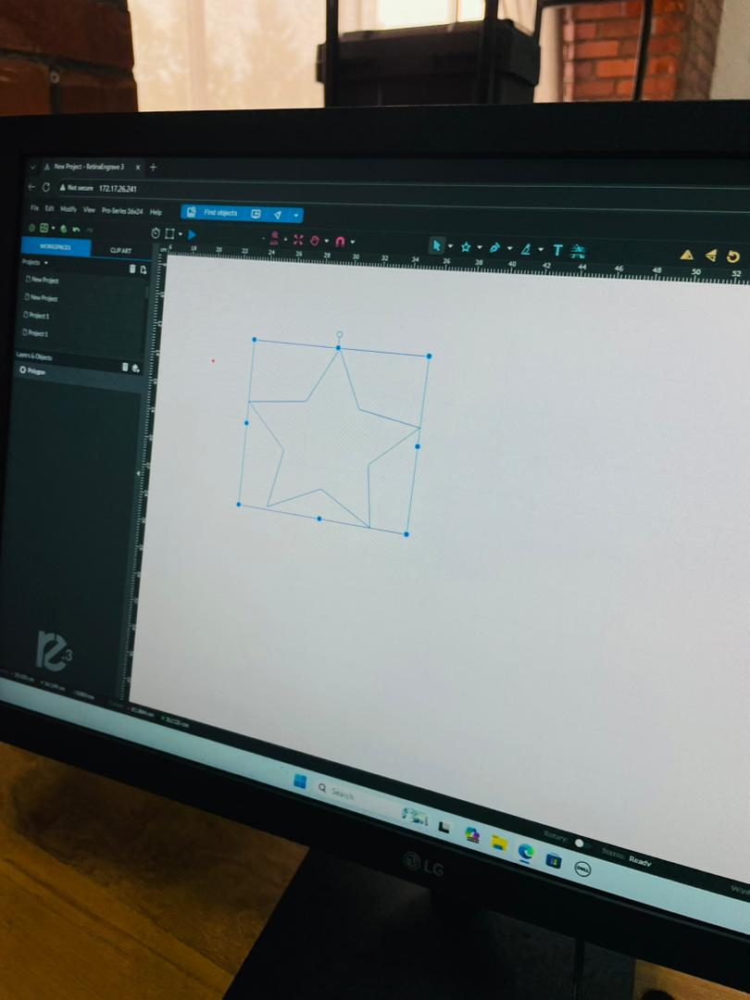
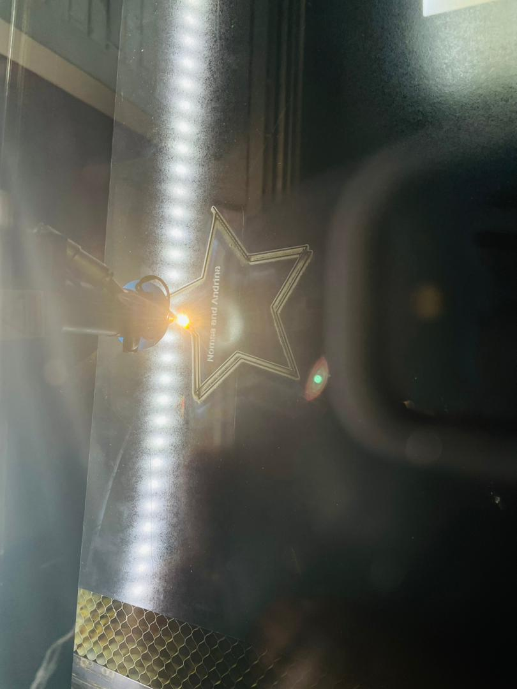

# 5. Activity of Day 5: Digital Fabrication – Laser Cutting

## Objective

The objective of this session was to understand the main components of a laser cutter, learn safe operating procedures, and gain practical experience in remotely controlling the machine, designing a cutting file, and performing both engraving and cutting operations.

## Introduction

Laser cutting is a digital fabrication task that involves shaping materials that have been designed through software. It is one of the key digital fabrication techniques used for creating devices with precision. The process employs a high-powered, focused beam to precisely cut, engrave, or mark a wide array of materials, making it a versatile tool for modern fabrication.

## Key Aspects for Consideration

### Precision & Versatility

Laser cutting offers unparalleled precision when working with materials. The high-powered, focused beam enables accurate cutting, engraving, and marking operations. The technology is highly versatile, allowing work with:
- Delicate materials like wood and paper
- Robust materials like acrylic and plastics
- Thin metals and leather
- Composite materials

### Diverse Applications

From product design to customization and prototyping, laser cutting technology offers broad material compatibility and application possibilities. This makes it ideal for various industries, from crafts to manufacturing.

## Key Advantages

The benefits of laser cutting include:

1. **Unparalleled Precision** - Achieves exact cuts and engravings with minimal tolerance
2. **Remarkable Speed** - Processes designs quickly, enabling rapid prototyping
3. **Consistent Repeatability** - Produces identical results across multiple pieces
4. **Minimal Material Waste** - Precise control reduces scrap and maximizes efficiency
5. **Versatile Material Compatibility** - Works with numerous materials in a single workflow

## Practical Activity

### Step 1: Accessing the Laser Cutter via IP Address

The laser cutter was accessed using its **IP address** through a desktop computer on the same network. This allowed remote connection to the machine control interface, where machine status and job control could be monitored.

### Step 2: Design Preparation

A sketch containing both **engraving** and **cutting** elements was created. The design was prepared in a suitable format (such as SVG or DXF) for laser cutting and engraving operations.

### Step 3: Machine Setup

The material was placed on the laser cutter **honeycomb bed**, and the laser focus was checked to ensure accuracy. Proper ventilation and cooling systems were verified before starting the operation to ensure safe working conditions.

### Step 4: Engraving Process

Engraving was performed first using **lower power and appropriate speed settings** to mark the design (such as names or details) without cutting through the material.

### Step 5: Cutting Process

After engraving, the laser parameters were adjusted to **higher power settings** to cut the final shape from the material. The number of passes and cutting speed were controlled to achieve clean, precise cuts.

### Final Output

The completed piece demonstrates the combination of precise engraving and clean cutting. In this example, a star shape was created with names engraved on its surface and the entire piece cut to shape.

## Key Learning Points

- Remote machine control via IP address enables flexible operation and monitoring
- Design files must distinguish between engraving paths and cutting paths
- Power and speed settings directly affect the quality of engraving and cutting
- Material placement on the honeycomb bed ensures even heat distribution
- Sequential operations (engraving before cutting) optimize final results

## Download Reference

Links to reference files, PDF, booklets, and additional resources:

