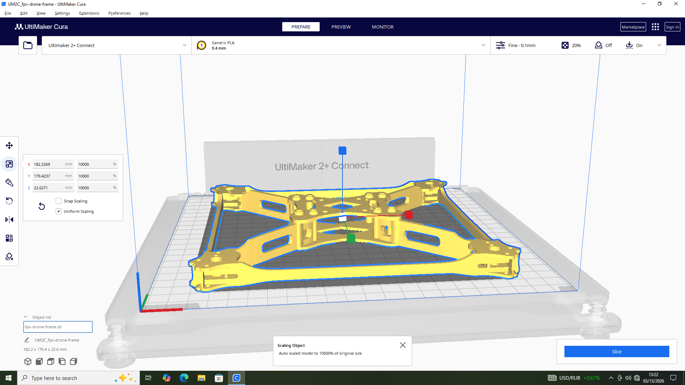
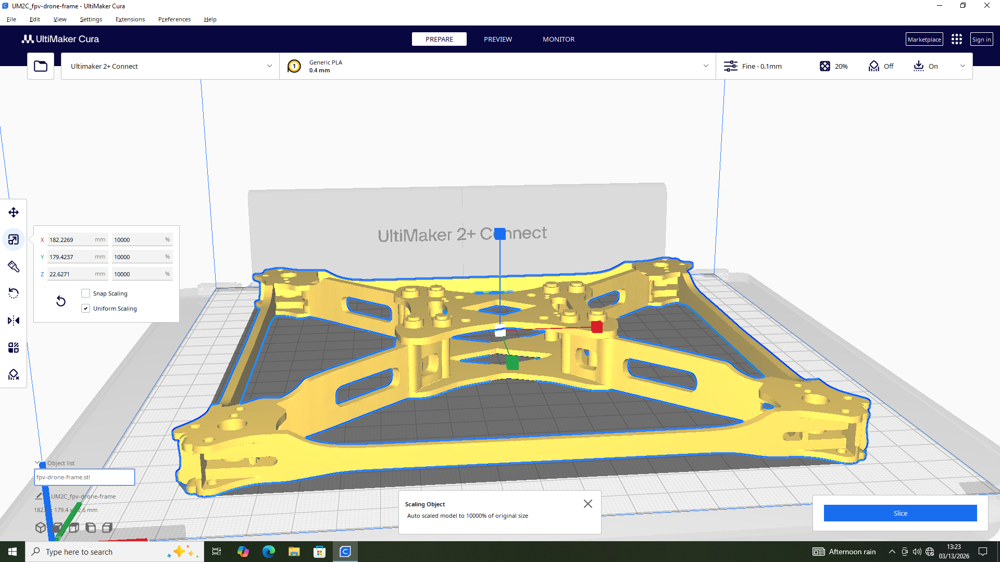
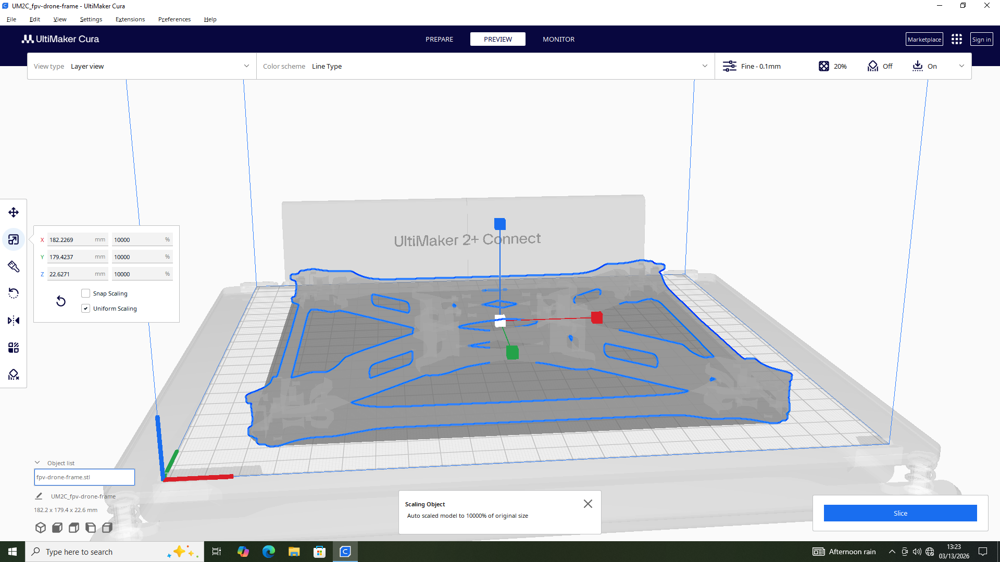
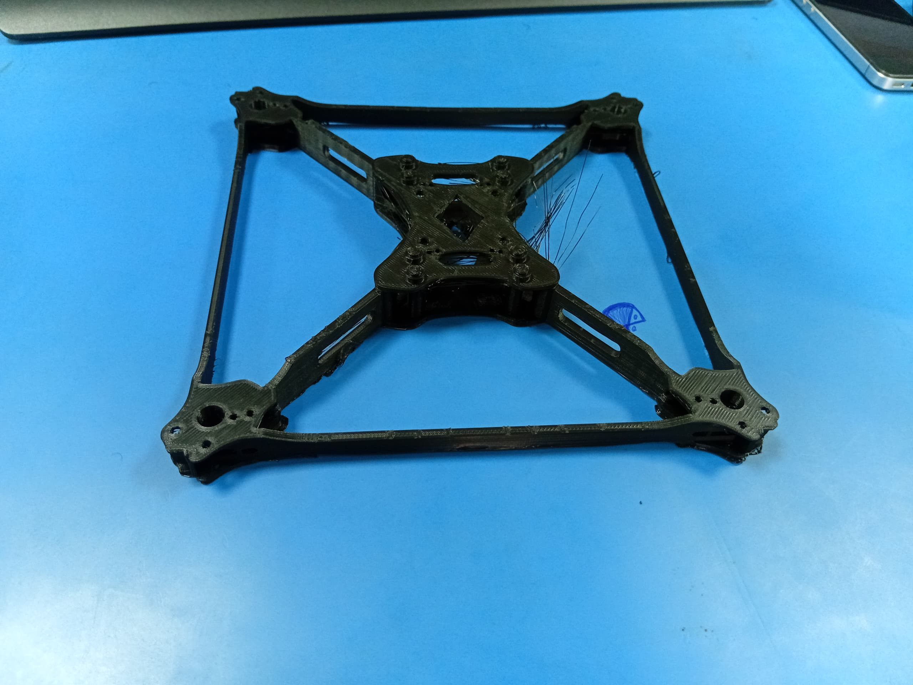
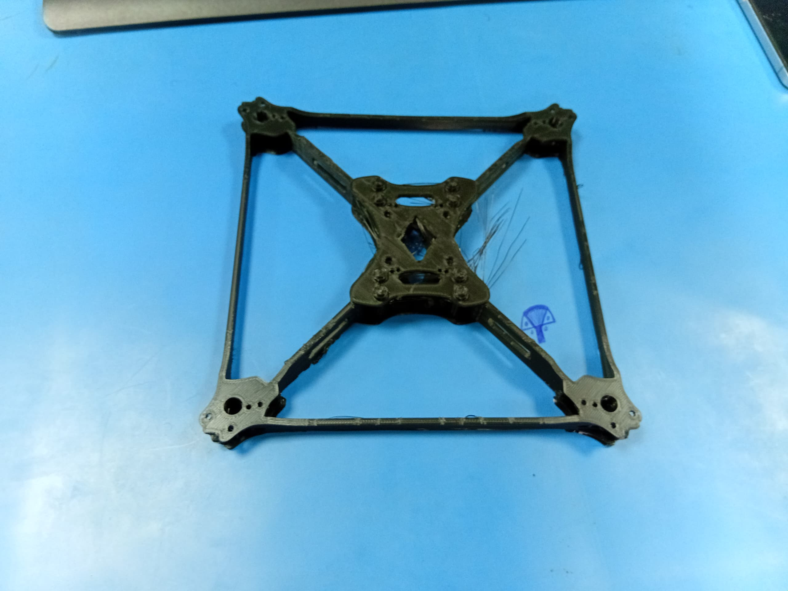
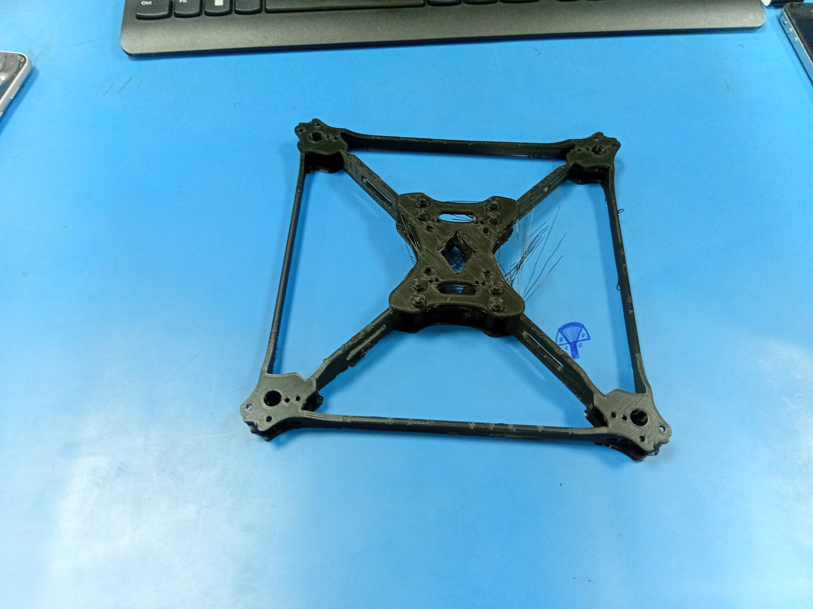
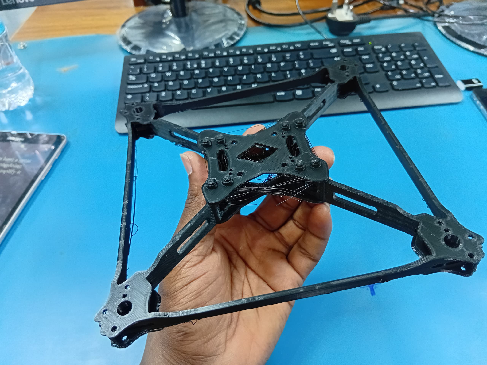

# 6. Activity of Day 6: Digital Fabrication II – Additive Manufacturing (3D Printing with Ultimaker)

## Introduction

Day 6 focused on **additive manufacturing** using the Ultimaker 2+ Connect FDM 3D printer. The session covered the full workflow from digital model preparation to physical print — including slicing, printer calibration, monitoring, and post-processing. The practical task for this session was printing an **FPV drone frame (quadcopter body)** from a prepared STL model (`fpv-drone-frame.stl`) using olive green PLA filament.

---

## Objectives

By the end of this session, the following outcomes were achieved:

- Understand the principles of **Fused Deposition Modeling (FDM)** and how it differs from subtractive manufacturing.
- Identify the key components of the **Ultimaker 2+ Connect** 3D printer and their functions.
- Prepare a 3D model for printing using **Ultimaker Cura** slicing software.
- Configure appropriate print parameters (layer height, infill, temperature, speed).
- Execute a complete print cycle from file transfer to finished physical object.
- Apply post-processing techniques and evaluate print quality.

---

## Tools & Materials

| Item | Details |
|------|---------|
| **3D Printer** | Ultimaker 2+ Connect |
| **Slicing Software** | Ultimaker Cura |
| **CAD/Model Software** | FreeCAD / Thingiverse (STL model) |
| **Filament** | PLA – Olive Green |
| **Model** | FPV Drone Frame (Quadcopter Body) – `fpv-drone-frame.stl` |
| **Additional Tools** | Isopropyl alcohol (bed cleaning), spatula (part removal) |

---

## Background Theory

### Additive Manufacturing

3D printing is an **additive manufacturing** process that constructs physical objects layer by layer from a digital model. Unlike subtractive methods (e.g., CNC milling, which cuts away material), additive manufacturing deposits material only where needed. This enables:

- Production of complex internal geometries
- Minimal material waste
- Rapid prototyping at low cost
- Customized, one-off part fabrication

### Fused Deposition Modeling (FDM)

**FDM** is the most widely used 3D printing technology for desktop printers. The process works as follows:

1. Thermoplastic filament (e.g., PLA, ABS) is fed from a spool into a heated print head.
2. The nozzle melts the filament and extrudes it in a precise pattern on the build plate.
3. Each extruded layer bonds to the one below as it cools and solidifies.
4. The build plate (or print head) moves along the Z-axis between layers.
5. The process repeats until the complete 3D object is formed.

Key advantages of FDM:
- **Affordable** – low machine and material costs
- **Versatile** – supports a wide range of thermoplastic materials
- **Accessible** – minimal post-processing for simple geometries
- **Scalable** – suitable for prototyping and small-batch production

### Ultimaker 2+ Connect – Printer Overview

The **Ultimaker 2+ Connect** is a professional-grade desktop FDM printer featuring:

- **Single Extrusion Head** with interchangeable nozzle sizes (0.25mm to 0.8mm)
- **Heated Glass Build Plate** – reduces warping and improves first-layer adhesion
- **Active Bed Leveling Assistance** – guides precise manual calibration
- **Network Connectivity** – enables Wi-Fi file transfer and remote monitoring
- **Open Material System** – compatible with third-party PLA, ABS, Nylon, TPU, and specialty filaments
- **Build Volume**: 223 × 220 × 205 mm

#### Main Printer Components

| Component | Function |
|-----------|----------|
| **Print Head / Nozzle** | Melts and extrudes filament at precise temperatures |
| **Feeder / Bowden Extruder** | Pushes filament from the spool to the print head |
| **Cooling Fans** | Rapidly cool extruded layers to preserve detail and structural integrity |
| **Heated Build Plate** | Glass surface heated to improve adhesion and reduce thermal warping |
| **Motion System (X/Y/Z)** | Drives precise positional movement using stepper motors and linear rails |
| **Control Interface** | Touchscreen and rotary dial for machine configuration |
| **Electronics & Firmware** | Manages all printer operations and communicates with Cura |

---

## Procedure: From Digital Model to Physical Print

### Step 1: Model Acquisition and Preparation

The drone frame model (`fpv-drone-frame.stl`) was sourced as an STL file. The model was inspected for printability before importing into the slicing software. Considerations at this stage include:

- Ensuring the model is **watertight** (no open meshes or holes)
- Checking that the **dimensions** are appropriate for the build volume
- Determining whether **support structures** are required for overhanging geometry

### Step 2: Import Model into Ultimaker Cura

The STL file was loaded into **Ultimaker Cura**. The software automatically places the model on the virtual build plate. At this stage:

- The model was **oriented** to minimize overhangs and support material
- **Scaling** was verified to match the intended physical dimensions
- The printer profile was set to **Ultimaker 2+ Connect** with the correct nozzle diameter

*Figure 1: FPV drone frame STL model (`fpv-drone-frame.stl`) imported into Ultimaker Cura, with Ultimaker 2+ Connect profile selected, Generic PLA at 0.4mm nozzle, and model auto-scaled to fit the build volume (182.2 × 179.4 × 22.6 mm).*

### Step 3: Configure Slicing Parameters

Print settings were configured based on the requirements of the drone frame geometry and the PLA filament in use:

| Parameter | Value Used | Rationale |
|-----------|-----------|-----------|
| **Layer Height** | 0.1 mm (Fine) | High resolution setting for detailed frame geometry |
| **Infill Density** | 20% | Sufficient structural strength for the frame geometry |
| **Infill Pattern** | Grid / Lines | Efficient for structural parts |
| **Print Speed** | 50–60 mm/s | Standard speed for PLA |
| **Nozzle Temperature** | 210°C | Optimal melting range for PLA |
| **Bed Temperature** | 60°C | Promotes adhesion for PLA |
| **Supports** | Enabled (where required) | Drone frame has bridging sections |
| **Build Plate Adhesion** | Brim | Increases first-layer contact area |

*Figure 2: Closer view of the FPV drone frame model in Cura's PREPARE stage, clearly showing the arm geometry, motor mount corners, and central hub before slicing.*

### Step 4: Slice the Model and Review Layer Preview

After confirming all parameters, the model was **sliced** — converted from a 3D mesh into a sequence of G-code instructions the printer executes layer by layer. The **layer preview** mode in Cura was used to:

- Visually inspect each layer for gaps or anomalies
- Confirm support structure placement
- Review estimated print time and material usage
- Verify travel moves and retraction points that could cause stringing

*Figure 3: Cura PREVIEW tab in Layer View mode, showing the drone frame outline and build footprint. The "Slice" button is ready to be pressed to generate the G-code.*

### Step 5: Printer Setup and Calibration

Before starting the print, the following preparation steps were performed:

1. **Load Filament** – Olive green PLA filament was fed into the Bowden feeder and primed through the nozzle until consistent extrusion was observed.
2. **Level the Build Plate** – Manual bed leveling was performed using the Ultimaker's guided calibration procedure: a sheet of paper was used to set the correct nozzle gap at three reference points.
3. **Clean the Build Surface** – The glass plate was wiped with isopropyl alcohol to remove grease and dust, ensuring strong first-layer adhesion.
4. **Preheat** – The printer was preheated to nozzle 210°C / bed 60°C before initiating the print.
5. **Transfer File** – The sliced G-code file was transferred to the printer via USB or network.

### Step 6: Initiate Print and Monitor Progress

The print was started and monitored closely, particularly during the **first few layers**, which are critical for bed adhesion. Key observations during printing:

- **First layer** was observed for full contact with the build plate — no lifting or gaps.
- **Brim adhesion** performed correctly, anchoring the frame during the print.
- **Travel moves** were monitored for stringing between frame arms.
- The print was left to run to completion, with periodic checks on layer quality.

---

## Post-Processing

Once printing was complete:

1. **Cooling** – The part was allowed to cool fully on the build plate before removal to prevent warping.
2. **Part Removal** – A spatula was used to carefully separate the drone frame from the glass plate.
3. **Support Removal** – Any support structures were carefully snapped or cut away.
4. **Stringing Cleanup** – Fine filament strands (strings) between frame arms were removed using a heat gun or by careful trimming with flush cutters.
5. **Inspection** – The printed frame was inspected for dimensional accuracy, layer adhesion, and structural completeness.

---

## Results

The drone frame was successfully printed in olive green PLA. The following photographs document the final output:

*Figure 4: Completed FPV drone frame printed in olive green PLA – rear elevated view showing arm structure, motor mount corners, and central hub.*

*Figure 5: Overhead view of the drone frame, showing the symmetrical X-frame geometry, four motor mount corners, and stringing in the central hub area.*

*Figure 6: Full overhead view of the printed frame, confirming dimensional symmetry and arm-to-corner alignment.*

*Figure 7: Hand-held view of the completed FPV drone frame, giving a sense of scale and showing the underside arm geometry, motor mount holes, and visible stringing in the centre hub.*

### Print Quality Observations

| Aspect | Observation |
|--------|------------|
| **Layer Adhesion** | Strong — no visible delamination |
| **Dimensional Accuracy** | Frame geometry matches the digital model |
| **Stringing** | Moderate stringing visible in the central hub area — caused by long open travel moves between the arms at standard retraction settings |
| **Surface Finish** | Consistent layer lines; suitable for functional prototype use |
| **Structural Integrity** | Frame is rigid and holds its shape under manual load testing |

> **Note on Stringing:** The filament strands visible in the central hub area of the drone frame are caused by molten PLA oozing from the nozzle during open travel moves between the arms. This can be reduced in future prints by increasing the **retraction distance**, lowering **print temperature** by 5°C, or enabling **combing mode** in Cura to route travel paths within already-printed areas.

---

## Common Issues and Troubleshooting

| Issue | Likely Cause | Recommended Solution |
|-------|-------------|---------------------|
| **Warping** | Thermal contraction lifts edges from plate | Increase bed temperature; use a brim or raft; apply glue stick |
| **Stringing** | Nozzle ooze during travel moves | Increase retraction distance (e.g., 6–7 mm); lower temperature; enable combing |
| **Under-Extrusion** | Partial blockage or insufficient temperature | Check and clean nozzle; raise nozzle temperature; verify filament path |
| **Over-Extrusion** | Too much material deposited | Calibrate extrusion multiplier; check flow rate in Cura |
| **Poor Bed Adhesion** | Unlevelled plate or contaminated surface | Re-level bed; clean with IPA; preheat longer before printing |
| **Layer Shifting** | Mechanical slippage or print speed too high | Reduce print speed; tighten belts; check stepper motor connections |
| **Bridging Failure** | Insufficient cooling for unsupported spans | Increase fan speed; reduce bridge speed; add support structures |

---

## Reflection

This session provided a complete, end-to-end experience of FDM 3D printing using the Ultimaker 2+ Connect — from digital preparation in Cura through to a finished physical prototype. Printing a functional part (drone frame) as opposed to a decorative object highlighted several practical considerations:

- **Orientation matters** — rotating the model to minimise overhangs directly reduces support material and post-processing effort.
- **Parameter tuning is iterative** — the stringing observed in the drone frame result indicates that retraction and travel settings benefit from optimization for open-geometry parts.
- **First-layer quality is critical** — a well-calibrated bed with a clean surface is the single most important factor in preventing print failure.
- **Slicing preview is an essential step** — reviewing layer-by-layer paths before printing identifies potential issues without wasting filament or time.

The drone frame was successfully produced as a functional prototype in olive green PLA, demonstrating the viability of FDM printing for lightweight structural components in FPV racing drone and UAV applications.

---

## Key Learning Points

- FDM builds objects additively layer by layer by melting and extruding thermoplastic filament.
- The Ultimaker 2+ Connect is a reliable desktop FDM printer with network connectivity and an open material system.
- Ultimaker Cura converts 3D models into G-code, controlling every aspect of the print path and parameters.
- Print quality is determined by the interplay of layer height, print speed, temperature, infill, and supports.
- Post-processing (support removal, stringing cleanup) is a normal part of the FDM workflow.
- Observing and understanding print defects (stringing, warping, under-extrusion) is essential for iterative improvement.

---

## Download Reference

Links to reference files, PDF, booklets, and additional resources:

