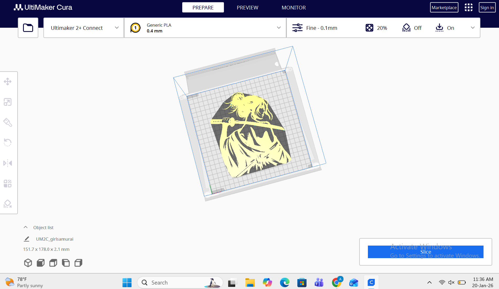
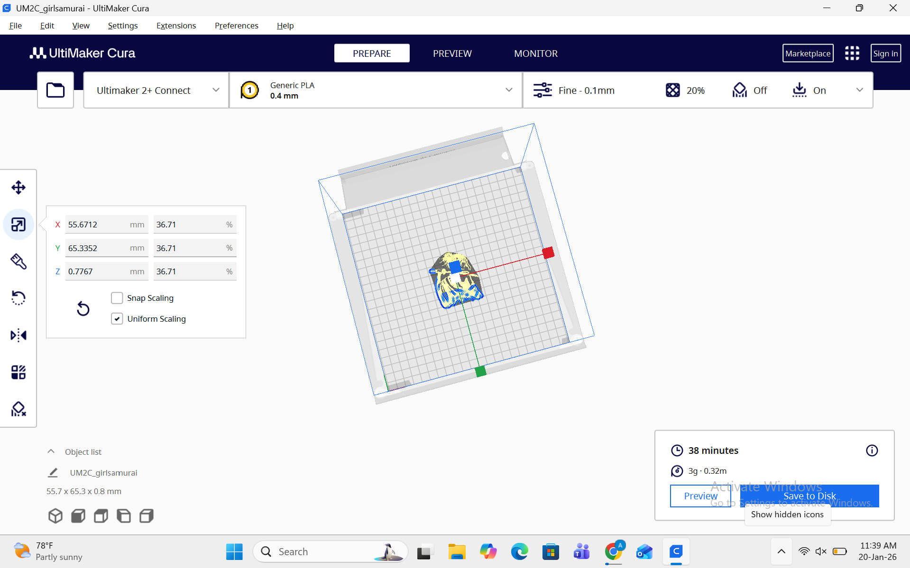
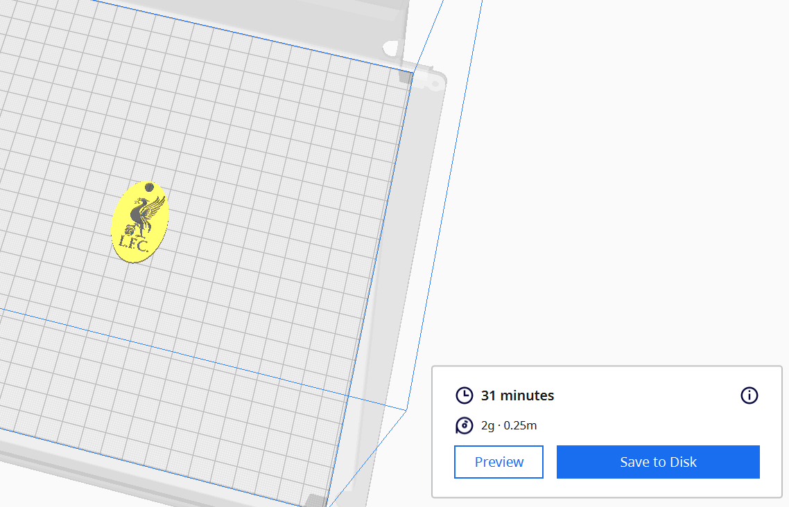

# 6. Activity of Day 6: Digital Fabrication II – Additive Manufacturing

## Objective

The session aimed to understand the main components and operation of an Ultimaker 3D printer, learn safe handling and calibration procedures, prepare digital models for printing, and perform a complete print cycle from slicing to post-processing.

## Introduction to 3D Printing

### Additive Manufacturing Overview

3D printing is an **additive process** that builds objects layer by layer according to a digital model, transforming virtual designs into tangible objects. Unlike subtractive methods that remove material, additive manufacturing adds material precisely where needed, enabling complex geometries and customized designs.

### Fused Deposition Modeling (FDM)

The Ultimaker printer uses **Fused Deposition Modeling (FDM)** technology, which melts and extrudes thermoplastic filament to construct objects layer by layer. This technology is widely used because it is:
- Affordable and accessible
- Versatile with various materials
- Suitable for prototyping and production
- Ideal for educational and professional use

### Tools Used

- **3D Printer**: Ultimaker 2+ Connect
- **Design Software**: Applications like FreeCAD for creating 3D models
- **Slicing Software**: Ultimaker Cura for preparing files and adjusting print parameters
- **Materials**: PLA filament in various colors (grey, yellow, etc.)

---

## Ultimaker Printer Overview

### Key Features

- **Desktop FDM Printer**: Compact, user-friendly design for professional or educational use
- **Dual Extrusion Capability**: Enables multi-material or multi-color printing
- **Heated Build Plate**: Ensures good adhesion and reduces warping
- **Open Material System**: Supports third-party filaments for flexibility
- **Network Connectivity**: Ultimaker 2+ Connect features remote monitoring and control
- **Reliability & Precision**: Produces high-quality, consistent prints with fine detail

### Main Components

1. **Print Head/Nozzle** - Heats and extrudes filament at precise temperatures
2. **Feeder/Extruder** - Pushes filament into the nozzle
3. **Cooling Fans** - Maintain part integrity and detail quality
4. **Filament System** - Guides filament from spool to print head
5. **Build Plate** - Heated glass surface where objects are printed
6. **Motion System** - Controls X, Y, Z axes movement with precision
7. **Control & Electronics** - Screen interface and internal circuits for machine control

---

## Workflow: From Design to Finished Print

### Step 1: Model Selection or Creation

Models can be:
- Created using 3D modeling software (FreeCAD, Fusion 360, etc.)
- Downloaded from repositories like Thingiverse or MyMiniFactory
- Imported in standard formats (STL, OBJ)

For this activity, pre-made designs were downloaded to optimize time, including a Liverpool keychain.

### Step 2: Import and Prepare in Ultimaker Cura

Open the 3D model file in **Ultimaker Cura**, the slicing software that:
- Converts the 3D model into machine-readable instructions
- Allows model positioning and scaling on the build plate
- Provides real-time preview of the print

### Step 3: Configure Slicing Settings

Key parameters to adjust before printing:

| Setting | Impact | Typical Values |
|---------|--------|-----------------|
| **Layer Height** | Affects resolution and print speed | 0.1mm (fine) to 0.4mm (fast) |
| **Infill Density** | Determines strength vs. material usage | 10-20% (light), 50% (moderate), 100% (solid) |
| **Print Speed** | Balances quality and printing time | 30-60 mm/s |
| **Nozzle Temperature** | Depends on filament type | PLA: 200-220°C |
| **Bed Temperature** | Ensures adhesion | PLA: 60-80°C |
| **Supports & Adhesion** | Critical for complex geometries | Enabled when needed |

In this example, a Liverpool keychain was configured with fine settings (0.1mm layer height) resulting in a 31-32 minute print time with grey filament.

### Step 4: Printer Setup & Calibration

Before initiating the print:

1. **Load Filament** - Feed filament properly into the extruder until it extrudes smoothly
2. **Level Build Plate** - Ensure the plate is perfectly flat for even first layer adhesion
3. **Clean Build Surface** - Remove oils, dust, and debris with isopropyl alcohol
4. **Preheat Printer** - Allow nozzle and bed to reach target temperatures for material compatibility
5. **Verify Settings** - Confirm all slicing parameters are correct

### Step 5: Initiate and Monitor Print

1. **Send File** - Transfer the sliced file to the printer via USB or network (Ultimaker 2+ Connect supports both)
2. **Monitor First Layers** - Watch the initial layers carefully to ensure proper bed adhesion
3. **Layer-by-Layer Construction** - The printer extrudes filament in precise patterns, building the object layer by layer
4. **Active Cooling** - Cooling fans maintain part integrity and help preserve fine details

---

## Post-Processing

### Finishing Steps

1. **Let the Object Cool Down** - Wait for the printed part to cool to room temperature
2. **Remove from Build Plate** - Carefully lift the finished object from the heated surface
3. **Detach Support Structures** - Gently remove any support material used during printing
4. **Clean Up** - Remove excess filament strands and sand if needed for smoother finish

### Quality Results

The completed prints demonstrate the precision of FDM technology:
- Fine details are clearly visible
- Layer lines are minimal with appropriate settings
- The design maintains structural integrity
- Multi-color or patterned designs are possible with careful planning

---

## Common Issues and Troubleshooting

| Issue | Cause | Solution |
|-------|-------|----------|
| **Warping** | Edges lift from build plate due to temperature stress | Increase bed temperature, use adhesion aids (glue stick, tape) |
| **Stringing** | Fine filament strands between parts | Increase retraction distance, reduce travel speed |
| **Under-Extrusion** | Gaps or thin sections in the print | Check nozzle temperature, verify filament path, clean nozzle |
| **Over-Extrusion** | Excess material, rough surface | Reduce extrusion multiplier, lower nozzle temperature |
| **Build Plate Adhesion** | Print doesn't stick properly | Level bed, clean surface, preheat bed longer |
| **Complex Geometry Issues** | Non-flat objects produce mesh-like structures | Enable supports, adjust orientation, increase infill |

---

## Key Learning Points

- **Software Preparation** - Proper slicing and configuration directly impacts print success
- **Time Management** - Print times depend heavily on model complexity, layer height, and infill density
- **Material Properties** - Different filaments require different temperature and speed settings
- **Quality vs. Speed Trade-off** - Fine prints take longer but deliver better detail
- **Network Capability** - Ultimaker 2+ Connect allows remote monitoring and flexible workflow management
- **Post-Processing** - Finishing work is essential for professional-quality results

---

## Download Reference

Links to reference files, PDF, booklets, and additional resources:

