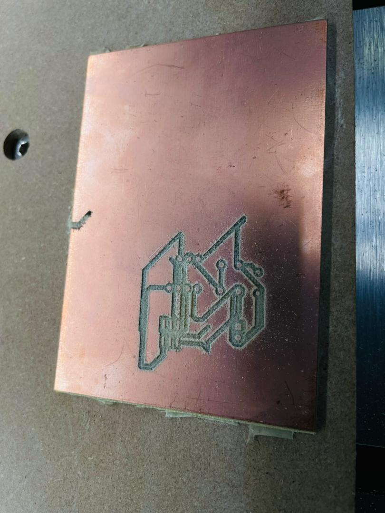
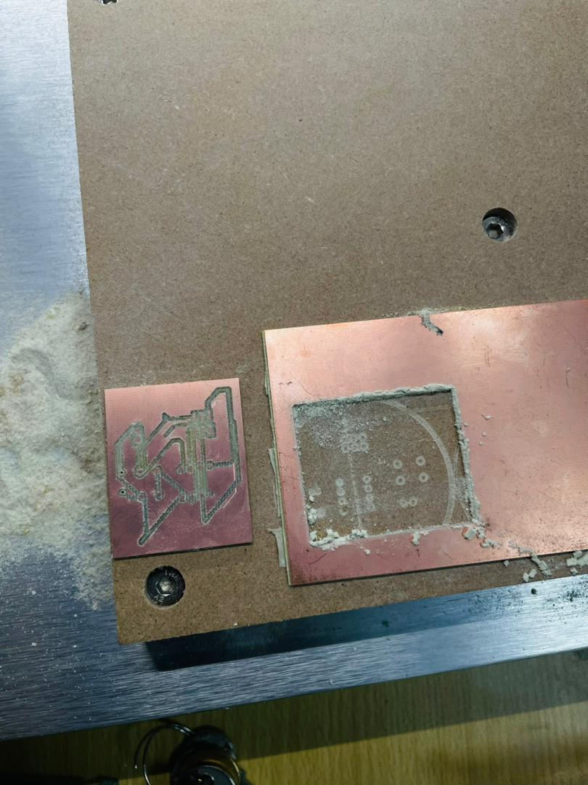
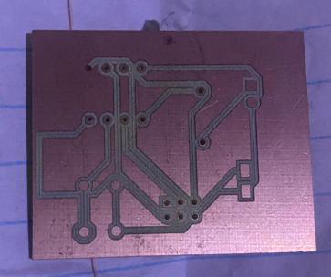

# 7. Activity of Day 7: Digital Fabrication III – CNC Router Milling & Cutting

## Overview

CNC (Computer Numerical Control) milling is a subtractive manufacturing process that uses precision cutting tools to remove material from a workpiece according to digitally designed paths. On Day 7, we fabricated PCB (Printed Circuit Board) designs that were originally created on Day 3 using KiCad. The process demonstrates the complete workflow from digital design to physical product using automated machine control.

## Recap: Foundation from Day 3

On **Day 3**, we created detailed PCB designs using **KiCad**, including:
- Electronic schematic design with component connections
- Component placement optimization on the PCB layout
- Routed copper tracks connecting components
- Design verification and electrical rule checking
- Preparation of manufacturing files (Gerber files, drill files, outline files)

This work forms the foundation for today's CNC milling fabrication process.

---

## CNC Router Overview

### What is CNC Milling?

CNC milling is a **subtractive digital fabrication method** that:
- Uses computer-controlled cutting tools to remove material precisely
- Follows digital toolpaths generated from design files
- Achieves high precision and repeatability
- Suitable for PCB fabrication, prototyping, and production
- Enables complex designs with tight tolerances

### Key Components

- **Cutting Tool/Spindle** - Rotates at high speeds to remove material
- **Workpiece Bed** - Holds the material (copper-clad PCB board) securely
- **Multi-Axis Motion System** - Controls X, Y, Z axes for precise positioning
- **Control Software** - Carbide Motion (in this case) interprets toolpaths and commands the machine
- **Tool Changer** - Allows switching between different cutting tools mid-operation

---

## Workflow: Design to Fabrication

### Step 1: Export Design Files from KiCad

The PCB design from Day 3 is exported in industry-standard formats:
- **Gerber Files** (.gbr) - Copper trace artwork for each layer
- **Drill Files** (.txt, .xln) - Hole locations and sizes
- **Outline Files** (.gbr) - PCB edge and boundary definition

### Step 2: Import to Carbide Motion Website

The design files are uploaded to **Carbide3D's web-based tool** ([Carbide3d](https://copper.carbide3d.com/)) for configuration:

**Available Adjustments:**
- Page settings and material type selection
- Milling depth for copper trace engraving
- Cutting depth for PCB outline
- Tool selection (end mills, V-bits, drills)
- Machine size compatibility
- Feed rates and spindle speeds
- Automatic toolpath generation

This online tool ensures files are optimized for the specific CNC machine's capabilities and cutting bed size.

### Step 3: Transfer to Carbide Motion Software

The configured files are downloaded and imported into **Carbide Motion**, the desktop control software that:
- Visualizes the toolpaths and workpiece layout
- Allows manual adjustment of tool paths if needed
- Provides axis positioning controls (X, Y, Z)
- Enables tool change sequences
- Monitors machine status during operation

### Step 4: Machine Setup and Calibration

Before initiating the mill:

1. **Material Preparation** - Secure copper-clad PCB board firmly on the CNC bed
2. **Tool Loading** - Install the initial cutting tool (typically an end mill for engraving traces)
3. **Set Machine Origin** - Establish the X, Y, Z home position for accurate positioning
4. **Tool Offset Configuration** - Program the specific tool diameter and cutting depth
5. **Verify Clearances** - Ensure no collisions between tool and clamps/fixtures

### Step 5: Engraving Process

The CNC router begins operation:

1. **Trace Engraving** - The spindle rotates at high speed and carefully engraves copper traces
   - Creates shallow grooves in the copper layer to isolate electrical paths
   - Follows the toolpaths generated from the Gerber files
   - Precision ensures proper trace isolation without damaging the substrate

2. **Hole Drilling** - The machine automatically locates and drills component mounting holes
   - Uses drill bits matching the drill file specifications
   - May require tool changes during the operation
   - Ensures accurate component placement during assembly

### Step 6: Cutting and Completion

1. **Tool Change** - Spindle switches to a cutting tool (saw or end mill) for the PCB outline
2. **Outline Cutting** - The machine cuts around the PCB perimeter following the outline file
3. **Material Separation** - The finished PCB is carefully removed from the bed
4. **Cleanup** - Dust and debris are removed; burrs are smoothed if necessary

---

## Final Results

The completed PCB demonstrates the precision of CNC milling:

**Key Quality Indicators:**
- Clean, well-defined copper traces
- Proper trace width and spacing
- Accurately positioned holes for component mounting
- Clean PCB outline with minimal burrs
- Electrical isolation between traces confirmed
- Ready for component soldering and assembly

The images show various angles and stages of the fabricated PCB, demonstrating:
- Detailed trace patterns with proper interconnections
- Accurate hole placement for components
- Professional finish suitable for electronics assembly

---

## Critical Parameters in CNC Milling

| Parameter | Purpose | Typical Range |
|-----------|---------|-------------------|
| **Spindle Speed (RPM)** | Tool rotation rate | 10,000-24,000 RPM |
| **Feed Rate (mm/min)** | Tool advancement speed | 100-500 mm/min |
| **Depth of Cut** | Cutting depth per pass | 0.5-2 mm per pass |
| **Tool Diameter** | Determines trace width and hole size | 0.8mm to 3mm |
| **Z Clearance** | Safe vertical clearance between passes | 2-5 mm |

---

## Advantages of CNC Milling for PCB Fabrication

1. **Precision** - Achieves trace widths down to 0.2mm with tight tolerances
2. **Repeatability** - Produces identical boards for batch production
3. **Flexibility** - Adapts to different PCB designs without extensive setup changes
4. **Speed** - Fabricates complex boards faster than manual methods
5. **Quality** - Minimal defects and clean copper edges
6. **Tool Availability** - Supports both prototyping and small-scale production

---

## Common Challenges and Solutions

| Challenge | Cause | Solution |
|-----------|-------|----------|
| **Copper Breakout** | Tool moves too fast or too deep | Reduce feed rate, increase passes |
| **Rough Traces** | Dull tool or high feed rate | Replace tool, optimize speed/feed |
| **Hole Misalignment** | Workpiece shifted during cutting | Secure material firmly, use dowel pins |
| **Tool Breakage** | Excessive depth or sudden impact | Reduce depth of cut, monitor operation |
| **Burrs on Outline** | Dull tool or rapid exit | Use sharp tools, slow speed at edges |

---

## Workflow Integration

This Day 7 activity completes the digital fabrication cycle:

- **Day 3** → Design creation (KiCad schematic and layout)
- **Day 5** → Laser cutting techniques (precision subtractive method)
- **Day 6** → Additive manufacturing (3D printing)
- **Day 7** → CNC milling (precision subtractive method for PCBs)

Each technology demonstrates different approaches to transforming digital designs into physical products.

---

## Next Steps After CNC Milling

After fabrication, the PCB is ready for:

1. **Cleaning** - Remove copper debris and residual material
2. **Component Soldering** - Install electronic components into drilled holes
3. **Testing** - Verify electrical connections and functionality
4. **Assembly** - Integrate with other fabricated parts (mechanical, 3D-printed, laser-cut)
5. **Integration** - Complete the final product or prototype

---

## Download Reference

Links to reference files, PDF, booklets, and additional resources:

