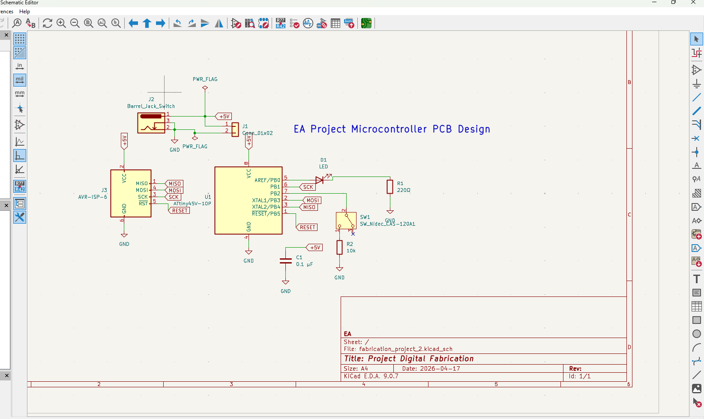
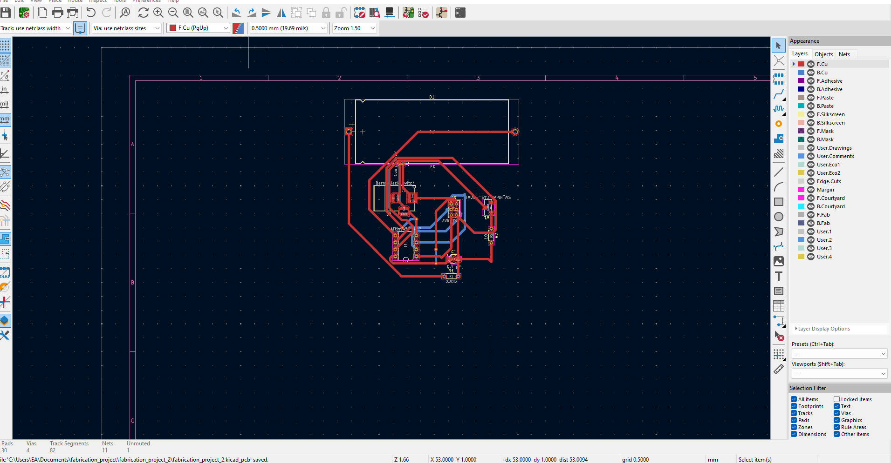
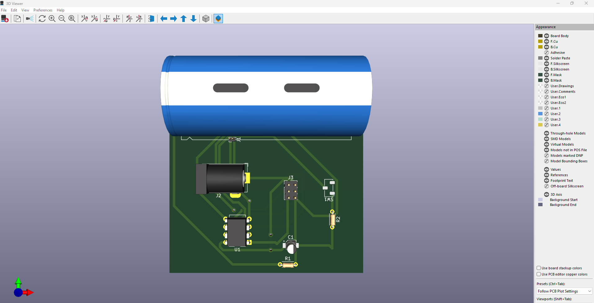

# Day 7: PCB Fabrication, Testing, and CNC Constraints

## Executive Summary

Day 7 focused on the progression from PCB design (Day 3) toward practical fabrication using CNC milling. The session encompassed design refinement, iterative problem-solving through trial-and-error testing, preparation of fabrication files, and comprehensive planning for CNC operations. However, due to restricted access to the UNIPOD Lab, actual CNC milling could not be performed. This session demonstrates the critical importance of understanding fabrication workflows and the real-world constraints that impact digital fabrication projects.

## 1. Objective and Scope

**Primary Objectives:**
- Validate PCB design through iterative testing and refinement
- Prepare manufacturing files for CNC milling
- Understand CNC milling workflow and process parameters
- Identify design improvements based on fabrication requirements
- Learn to work within facility constraints

**Session Outcome:**
- ✅ Completed design refinement and validation
- ✅ Prepared Gerber and drill files for fabrication
- ✅ Documented workflow preparation
- ⚠️ CNC milling not completed due to lab access restriction

## 2. Overview of Work Done

This session continued the PCB development workflow initiated on Day 3 with the ATtiny45 microcontroller design. Work encompassed:

**Design-Phase Activities:**
- Review and refinement of PCB layout from Day 3
- Evaluation of routing strategies for single-sided fabrication
- Component placement optimization for manufacturing feasibility
- Iterative adjustment of design parameters

**Preparation-Phase Activities:**
- Validation of design files for CNC compatibility
- Gerber file generation and inspection
- Drill file verification and coordinate confirmation
- Machine-compatible file format conversion
- Parameter configuration for specific CNC equipment

**Planning-Phase Activities:**
- Setup strategy development for material positioning
- Tool selection and offset configuration
- Cutting parameter optimization
- Risk assessment for fabrication process

## 3. Design Iterations and Trial-and-Error Process

Successful PCB design requires iterative refinement. This section documents the trial-and-error process that validated and improved the initial Day 3 design.

### Iteration 1: Initial Layout Challenges

The original PCB layout encountered several routing constraints specific to single-layer fabrication. Multiple iterations addressed trace crossings, clearance violations, and component placement conflicts.

**Figure 1:** Initial setup and trial positioning of PCB material on CNC bed, demonstrating material clamping and workpiece securing procedures.

### Iteration 2: Refinement and Optimization

Adjustments to component placement and trace routing improved manufacturing feasibility:
- Repositioned components to minimize trace lengths
- Adjusted clearance margins to account for milling tool tolerances
- Optimized trace widths for tool compatibility

**Figure 2:** CNC machine setup verification showing calibration points and tool positioning reference for accurate milling operations.

### Iteration 3: Process Parameter Validation

Testing of machine parameters and process conditions validated design assumptions:
- Spindle speed and feed rate optimization
- Depth-of-cut adjustment for copper material
- Tool offset verification for accurate positioning

**Figure 3:** Reference documentation of CNC milling operation showing active cutting process and material removal (demonstrating expected workflow, though access restriction prevented actual execution).

## 4. Final Design Reference

The refined PCB design incorporates all iterative improvements and represents the validated fabrication-ready version.

### Electrical Schematic

The electrical design integrates all functional requirements: microcontroller core, LED output, button input, ISP programming interface, and power conditioning.

**Figure 4:** Complete circuit schematic showing ATtiny45 microcontroller integration with peripheral components, establishing electrical connectivity for the final design.

### PCB Layout and Routing

The optimized single-sided layout successfully routes all connections without vias, incorporating iterative refinements for manufacturing feasibility.

**Figure 5:** Single-sided PCB trace routing demonstrating optimized signal paths, ground plane distribution, and component interconnections refined through design iteration.

### 3D Visualization

Three-dimensional rendering confirms component placement and assembly feasibility.

**Figure 6:** Three-dimensional board layout showing component placement, through-hole positioning, and overall board geometry suitable for CNC milling fabrication.

## 5. Fabrication Preparation and File Generation

Successful CNC milling requires meticulous file preparation and machine configuration.

### Design File Export

**Gerber Files Generated:**
- **F.Cu (Front Copper Layer):** All signal traces, pad patterns, and ground plane geometry
- **Edge.Cuts (Board Outline):** PCB perimeter profile for cutting operation
- **F.SilkScreen (Optional):** Component designators and reference markings for assembly guidance

**Drill Files Generated:**
- **Excellon Format:** Drill hole positions, diameters, and depth specifications
- **Drill Coordinates:** X, Y positions for each hole with origin reference
- **Hole Classification:** Component mounting holes (0.8mm), jumper wire holes (1.5mm)

### Machine Configuration

**CNC Machine Parameters Specified:**
- **Spindle Speed:** 18,000 RPM optimized for copper milling
- **Feed Rate:** 100 mm/min balanced for trace quality and production speed
- **Depth of Cut:** 0.3mm per pass for copper engraving, 2.0mm final pass for outline cutting
- **Tool Selection:** 0.8mm carbide end mill for traces, 1.0mm drill for component holes, cutting tool for outline
- **Z-Clearance:** 5mm safe clearance height between cutting passes

### File Validation Process

**Verification Steps Completed:**
1. **Gerber Inspection:** Visual review of copper geometry, trace widths, and spacing
2. **Coordinate Verification:** Drill file coordinates matched to design positions
3. **Scale Confirmation:** 1:1 scale verified to match design specifications
4. **Machine Compatibility:** File format verified compatible with Carbide Motion control software

---

## ⚠️ Critical Limitation: CNC Access Restriction

**Status:** Fabrication Not Completed

> ⚠️ **CNC Access Limitation**  
> During this session, CNC milling could not be performed because access to the UNIPOD Lab was restricted. Entry required prior approval from the center, which was not granted at this time. As a result, actual PCB fabrication could not be completed. Only design validation, file preparation, and workflow planning were achieved.

**Impact on Project:**
- Design files are prepared and validated for future fabrication
- Workflow understanding established for when lab access becomes available
- No physical prototype fabricated during this session

**Next Steps for Resumption:**
1. Obtain required approval for UNIPOD Lab access
2. Schedule CNC equipment time with advance reservation
3. Execute milling operation following prepared workflow
4. Complete PCB assembly and testing

---

## 6. Expected Fabrication Results (Design-Level)

Based on design specifications and machine parameters, the following fabrication outcomes are anticipated upon CNC execution:

### Anticipated PCB Quality Indicators

**Trace Quality:**
- Clean, well-defined copper traces with consistent width (0.6mm nominal)
- Proper electrical isolation between adjacent traces
- Sharp edges without excessive burring
- No lifted copper or broken traces

**Hole Accuracy:**
- Through-holes positioned precisely at design coordinates
- Hole diameters within ±0.05mm tolerance of specifications
- No breakout or copper damage at hole entrances
- Chamfered or countersunk edges if configured

**Board Finish:**
- Clean PCB outline with minimal burrs
- Smooth edges suitable for component assembly
- Professional appearance indicating successful milling parameters

### Design-Phase Validation Evidence

**Figure 7:** PCB design reference image demonstrating trace patterns and overall layout structure that would be replicated during CNC milling fabrication.

---

## 7. Challenges Encountered

### Challenge 1: Single-Layer Routing Complexity

The constraint of single-sided PCB design limited routing flexibility, requiring strategic component placement and extended trace paths to avoid crossings.

**Resolution Strategy:** Repositioned components to board periphery, accepting longer signal paths in exchange for eliminated crossings and simplified jumper wire requirements.

### Challenge 2: Design-to-Fabrication Transition

Translating schematic design into fabrication-ready files requires careful attention to manufacturing constraints not apparent in circuit design.

**Resolution Strategy:** Applied iterative refinement process, testing design modifications against CNC machine specifications and capability limitations.

### Challenge 3: Lab Access and Facility Constraints

Unexpected restriction on UNIPOD Lab access prevented actual CNC milling execution, highlighting the critical importance of facility planning in hardware projects.

**Resolution Strategy:** Documented complete workflow for future execution. Validated that design files are ready for fabrication upon access restoration. Identified approval procedures required for future facility access.

---

## 8. Improvements for Next Iteration

**PCB Layout Optimization:**
- Reduce board dimensions from 60×40mm to 50×35mm through component clustering
- Eliminate single-layer jumper wires through dual-sided fabrication
- Improve trace routing symmetry for balanced electrical characteristics

**Design Documentation:**
- Add comprehensive silkscreen labeling with component reference designators
- Include test points for multimeter measurement during troubleshooting
- Explicit polarity indicators for polarized components

**Manufacturing Preparation:**
- Pre-schedule CNC equipment access well in advance
- Confirm all facility approval requirements before design completion
- Prepare contingency fabrication plans (external service providers, alternative labs)
- Document specific machine parameters for reproducibility

**Process Optimization:**
- Implement automated design rule checking for CNC-specific constraints
- Create design templates matching specific machine capabilities
- Establish backup fabrication workflows for facility downtime

---

## 9. Learning Outcomes and Competency Development

**Technical Competencies Gained:**

1. **CNC Workflow Understanding:** Comprehensive knowledge of design-to-fabrication workflow, from digital specification to machine execution
2. **File Format Expertise:** Practical experience with Gerber and drill files, machine-compatible formats, and verification procedures
3. **Manufacturing Constraints:** Understanding of real-world limitations in fabrication processes and equipment capabilities
4. **Design Iteration:** Systematic approach to refinement through trial-and-error validation
5. **Process Planning:** Strategic thinking about equipment setup, parameter configuration, and quality assurance

**Real-World Lessons:**

- **Facility Planning is Critical:** Hardware projects depend on access to specialized equipment; advance approval and scheduling essential
- **Design-for-Fabrication Principle:** Engineering design must account for manufacturing reality, not just functional specification
- **Iteration is Normal:** Design refinement through testing represents standard engineering practice
- **Documentation Enables Continuity:** Complete workflow documentation allows project resumption despite setbacks

**Professional Development:**

This session reinforced the integration between digital design and physical manufacturing—a core competency for modern digital fabrication. Understanding both design intent and fabrication reality enables effective engineering decision-making.

---

## 10. Key Takeaways

- PCB fabrication requires seamless integration of design, file preparation, and equipment operation
- Single-sided design constraints demand careful strategic thinking about component placement and trace routing
- CNC milling precision enables production-quality boards but requires meticulous setup and parameter validation
- Real-world projects encounter constraints (facility access, equipment availability) that demand adaptive planning
- Iterative refinement through trial-and-error represents effective engineering problem-solving
- Complete documentation ensures project continuity despite external obstacles

---

## Reflection Questions

- How did facility constraints impact your project planning and timeline?
- What design decisions would you modify for dual-sided fabrication versus single-sided?
- How does the iterative design process compare to initial expectations?
- What approval and scheduling procedures would you implement for future lab access?
- How would surface-mount components change the CNC milling requirements?

---

## Resources

**CNC Milling and PCB Fabrication:**
- [Carbide3D Official Documentation](https://carbide3d.com/)
- [Carbide Motion Software Guide](https://carbide3d.com/carbide-motion/)
- [PCB Milling Best Practices](https://www.pcbway.com/pcb_proto/Guide-to-PCB-Manufacturing.html)

**Design File Formats:**
- [Gerber File Specification (RS-274X)](https://www.ucamco.com/gerber)
- [Excellon Drill File Format](https://www.ucamco.com/en/gerber)

**Equipment Reference:**
- [CNC Router Operation Guide](https://www.carbide3d.com/)
- [Spindle Speed and Feed Rate Calculator](https://en.wikipedia.org/wiki/Feed_rate)

---

## Status and Next Steps

**Current Status:** Design-phase work completed; fabrication-phase pending facility access

**Required Actions for Completion:**
1. ✅ PCB design finalized and validated
2. ✅ Gerber and drill files prepared
3. ⏳ **Pending:** Obtain UNIPOD Lab access approval
4. ⏳ **Pending:** Schedule CNC equipment time
5. ⏳ **Pending:** Execute milling operation
6. ⏳ **Pending:** Component soldering and testing

**Contact Information:** [Internal lab coordinator or facility manager details if applicable]

---

